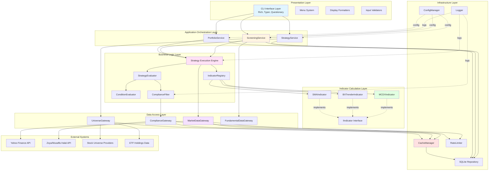
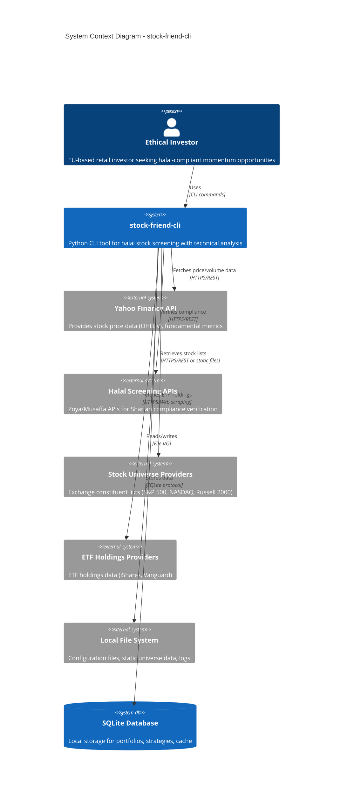
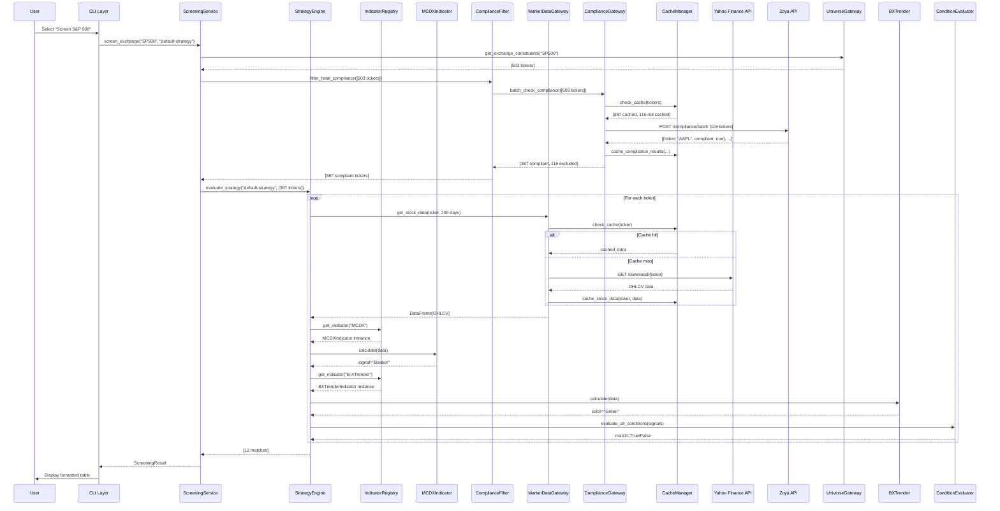
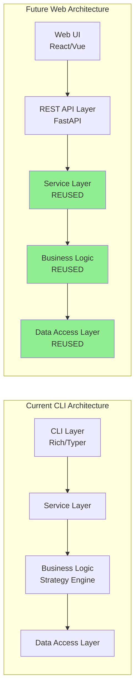
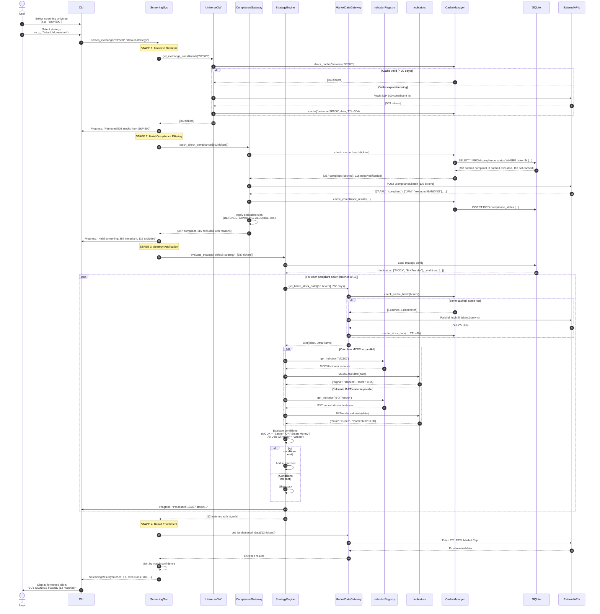
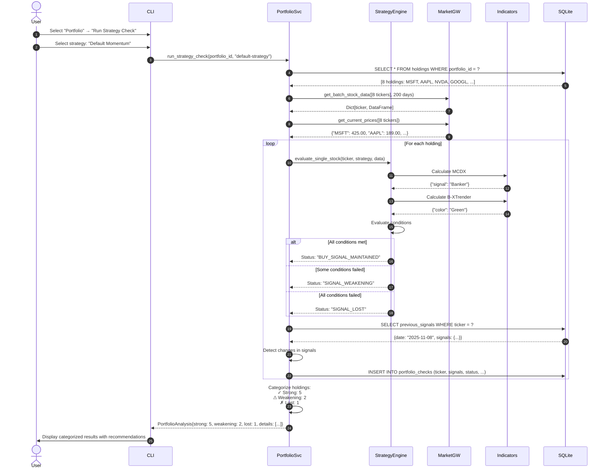
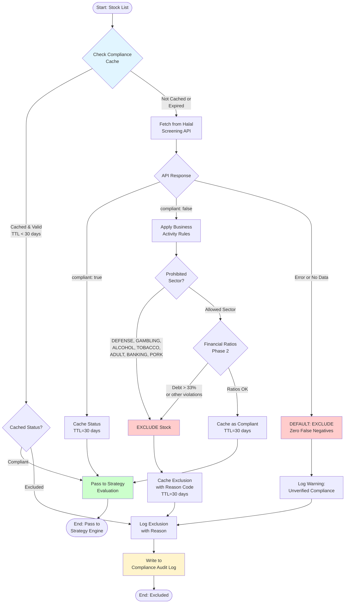
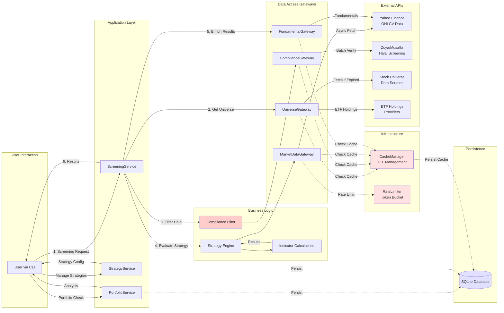
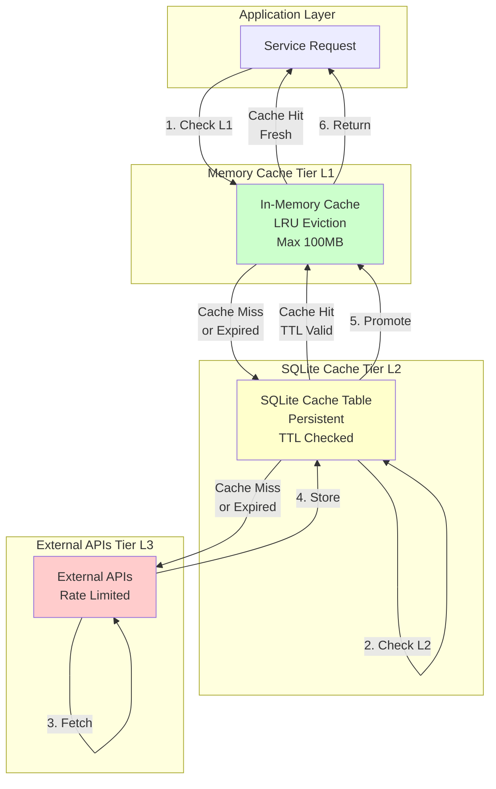
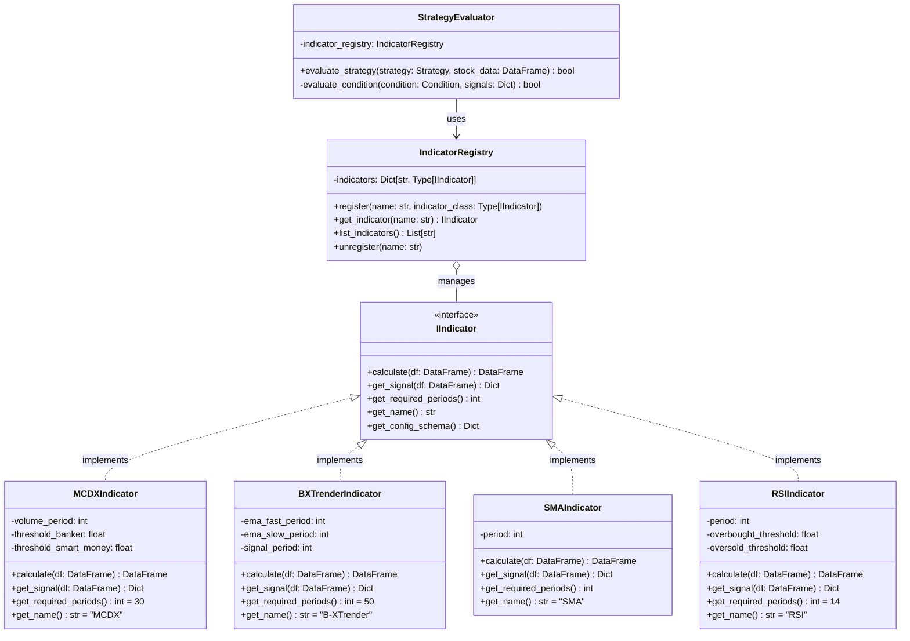

# Technical Requirements Document (TRD)
## stock-friend-cli: Halal-Compliant Stock Screening Tool

**Part 1: Architecture & Foundation**

---

## Document Information

**Version:** 1.0
**Date:** 2025-12-24
**Status:** Final - Ready for Implementation
**Target Audience:** Software Architects, Senior Developers, Implementation Teams
**Related Documents:** Product Requirements Document (PRD.md)

---

## Executive Summary

### Purpose

This Technical Requirements Document (TRD) translates business requirements from the PRD into comprehensive technical specifications for implementing stock-friend-cli, a Python-based command-line tool for halal-compliant, momentum-based stock screening.

### Document Structure

This TRD is divided into five parts:

- **Part 1: Architecture & Foundation** (this document) - System architecture, data flows, design patterns
- **Part 2: Data Models & Service Layer** - Domain models, database schema, service interfaces
- **Part 3: Indicator Architecture** - Technical indicator specifications (MCDX, B-XTrender, SMA)
- **Part 4: Integration, Security & Performance** - API integration, security, performance optimization
- **Part 5: Implementation & Testing** - MVP breakdown, testing strategy, development guidelines

### How to Use This Document

**For Architects:**
- Review system architecture (Phase 1) and design patterns (Phase 3)
- Validate layer separation and extensibility approach
- Assess migration path to web application

**For Developers:**
- Use service interface definitions as contracts for implementation
- Follow database schema for data persistence layer
- Reference indicator specifications for calculation algorithms
- Apply Clean Code principles and SOLID guidelines throughout

**For QA Engineers:**
- Use acceptance criteria for test case development
- Reference performance requirements for load testing
- Validate error handling specifications

### Technology Stack Summary

| Category | Technology | Version | Purpose |
|----------|-----------|---------|---------|
| **Language** | Python | 3.11+ | Core implementation |
| **CLI Framework** | Rich | 13.x | Terminal formatting, tables, progress bars |
| | Typer | 0.9+ | Command structure, argument parsing |
| | Questionary | 2.0+ | Interactive prompts, menus |
| **Data Processing** | Pandas | 2.x | Data manipulation, analysis |
| | NumPy | 1.24+ | Numerical calculations |
| | TA-Lib | 0.4+ (optional) | Technical analysis functions |
| **API Clients** | yfinance | 0.2+ | Yahoo Finance data retrieval |
| | aiohttp | 3.9+ | Async HTTP for parallel API calls |
| | requests | 2.31+ | Synchronous HTTP requests |
| **Data Storage** | SQLite | 3.x | Local database (portfolios, cache) |
| **Testing** | pytest | 7.x | Unit and integration testing |
| | pytest-mock | 3.x | Mocking external APIs |
| | pytest-cov | 4.x | Code coverage reporting |
| **Dependency Mgmt** | Poetry | 1.7+ | Dependency management, lock files |

**Minimum Requirements:**
- Python 3.11 or higher
- 200MB disk space for application and cache
- Internet connection for API access
- Supported OS: Windows 10+, macOS 12+, Linux (Ubuntu 20.04+)

---

## Phase 1: System Architecture Overview

### 1.1 Architectural Principles

The system follows a **layered architecture** with strict separation of concerns, enabling:

1. **Testability** - Each layer can be tested independently with mocked dependencies
2. **Extensibility** - New indicators, data sources, or UI layers can be added without modifying core logic
3. **Maintainability** - Clear boundaries and responsibilities reduce cognitive load
4. **Future Web Migration** - Business logic is decoupled from CLI presentation

### 1.2 High-Level Architecture



### 1.3 Layer Responsibilities

#### Presentation Layer (CLI Interface)
**Purpose:** User interaction, input validation, output formatting

**Responsibilities:**
- Render interactive menus using Questionary
- Display formatted tables and progress bars using Rich
- Parse command-line arguments using Typer
- Validate user input before passing to application layer
- Format results for terminal display
- Handle keyboard shortcuts and navigation

**Technology:** Rich, Typer, Questionary

**Key Principle:** Contains NO business logic. Pure presentation concerns only.

---

#### Application Orchestration Layer (Services)
**Purpose:** Coordinate workflows, orchestrate business logic and data access

**Responsibilities:**
- **ScreeningService:** Orchestrate stock screening workflow (universe selection → halal filter → strategy application → result formatting)
- **StrategyService:** Manage strategy CRUD operations, validation, persistence
- **PortfolioService:** Manage portfolio CRUD, holdings tracking, strategy validation on portfolio

**Technology:** Python (dataclasses, type hints)

**Key Principle:** Services are thin orchestrators. They delegate to business logic layer and data access layer but contain no domain logic themselves.

---

#### Business Logic Layer (Strategy Engine)
**Purpose:** Core domain logic for strategy evaluation and compliance filtering

**Responsibilities:**
- **StrategyEvaluator:** Evaluate stocks against strategy conditions
- **IndicatorRegistry:** Manage available indicators, instantiate on demand
- **ConditionEvaluator:** Evaluate individual strategy conditions (AND/OR logic)
- **ComplianceFilter:** Enforce halal filtering with zero false negatives guarantee

**Technology:** Python (abstract base classes, strategy pattern)

**Key Principle:** Pure business logic, fully testable with mocked data. No knowledge of data sources or presentation.

---

#### Indicator Calculation Layer
**Purpose:** Calculate technical indicator values from price/volume data

**Responsibilities:**
- Implement `IIndicator` interface for each indicator
- Calculate MCDX, B-XTrender, SMA, and future indicators
- Return standardized signal format
- Handle edge cases (insufficient data, low volume)

**Technology:** Pandas, NumPy, TA-Lib (optional)

**Key Principle:** Each indicator is a pluggable component implementing common interface. Adding new indicators requires zero changes to strategy engine.

---

#### Data Access Layer (Gateways)
**Purpose:** Abstract external data sources, provide unified data interface

**Responsibilities:**
- **MarketDataGateway:** Fetch OHLCV data from Yahoo Finance
- **ComplianceGateway:** Check halal compliance via Zoya/Musaffa APIs
- **UniverseGateway:** Retrieve stock universe lists (exchanges, sectors, ETFs)
- **FundamentalDataGateway:** Fetch fundamental metrics (P/E, EPS, etc.)

**Technology:** yfinance, aiohttp, requests

**Key Principle:** Gateways hide implementation details of external APIs. Swapping data providers requires changes only in this layer.

---

#### Infrastructure Layer
**Purpose:** Cross-cutting concerns (caching, logging, configuration, persistence)

**Responsibilities:**
- **CacheManager:** Memory and SQLite-based caching with TTL
- **RateLimiter:** Enforce API rate limits, queuing, exponential backoff
- **ConfigManager:** Load configuration from .env and JSON files
- **Logger:** Structured logging with rotation
- **Repository:** SQLite database access for portfolios, strategies, cache

**Technology:** SQLite, python-dotenv, logging module

**Key Principle:** Infrastructure components are singletons or dependency-injected utilities used across all layers.

---

### 1.4 C4 Context Diagram



**External System Dependencies:**

| System | Criticality | Purpose | Failure Impact |
|--------|------------|---------|----------------|
| Yahoo Finance API | **Critical** | Primary source for OHLCV data | Cannot screen stocks without price data. Fallback to cache if available. |
| Halal Screening APIs (Zoya/Musaffa) | **Critical** | Shariah compliance verification | Cannot guarantee halal compliance. Must block screening until available. |
| Stock Universe Providers | **High** | Exchange/index constituent lists | Cannot screen entire exchanges. Fallback to cached lists. |
| ETF Holdings Providers | **Medium** | ETF constituent lists | Cannot screen specific ETF. User can use custom list instead. |
| Local File System | **Critical** | Configuration, static data, logs | Application cannot start without config files. |
| SQLite Database | **Critical** | Portfolio and strategy persistence | Cannot manage portfolios or strategies. |

---

### 1.5 Component Interaction Diagram



**Key Interaction Patterns:**

1. **Orchestration:** Services orchestrate workflows but delegate domain logic to strategy engine
2. **Caching:** All data access checks cache before hitting external APIs
3. **Batch Processing:** Compliance and stock data fetched in batches for performance
4. **Lazy Indicator Instantiation:** Indicators created on-demand via registry
5. **Progressive Results:** Results can be streamed to user as screening progresses

---

### 1.6 Migration Path to Web Application

**Design Decisions for Future Web Migration:**

The architecture supports future migration to a web application with minimal changes:



**Migration Strategy:**

1. **Extract Core Library** - Package service layer, business logic, and data access as standalone Python library (`stock-friend-core`)
2. **Add REST API Layer** - Create FastAPI wrapper around service layer
3. **Build Web UI** - Develop React/Vue frontend consuming REST API
4. **CLI Remains** - CLI continues to use core library directly

**Code Reuse Estimate:** 85-90% of codebase reusable for web application.

**Required Changes for Web Migration:**
- Add FastAPI REST endpoints wrapping service methods
- Add authentication/authorization (JWT)
- Add WebSocket support for real-time progress updates
- Convert SQLite to PostgreSQL for multi-user support
- Add API rate limiting per user

---

## Phase 2: Data Flow Architecture

### 2.1 End-to-End Screening Workflow



**Critical Path Performance Requirements:**

| Stage | Target Time | Optimization Strategy |
|-------|-------------|----------------------|
| Universe Retrieval | <5 seconds | Cache for 30 days; static files for major indices |
| Halal Compliance (500 stocks) | <30 seconds | Batch API calls (50 tickers/request); cache for 30 days |
| Market Data Fetch (500 stocks) | <120 seconds | Async parallel fetching (10 concurrent); cache for 1 hour |
| Indicator Calculation (500 stocks) | <180 seconds | Vectorized operations with pandas; batch processing |
| Result Enrichment | <10 seconds | Cached fundamental data (24 hours TTL) |
| **Total (500 stocks)** | **<345 seconds (5.75 min)** | Well under 10-minute requirement |

---

### 2.2 Portfolio Strategy Validation Workflow



**Change Detection Logic:**

```python
def detect_signal_changes(current_signals: Dict, previous_signals: Dict) -> List[Change]:
    """
    Compare current indicator signals to previous check.

    Returns:
        List of changes with timestamp, old value, new value
    """
    changes = []

    for indicator_name, current_value in current_signals.items():
        previous_value = previous_signals.get(indicator_name)

        if previous_value != current_value:
            changes.append(Change(
                indicator=indicator_name,
                old_value=previous_value,
                new_value=current_value,
                changed_at=datetime.now(),
                severity=calculate_severity(indicator_name, previous_value, current_value)
            ))

    return changes

def calculate_severity(indicator: str, old_val: str, new_val: str) -> Severity:
    """Determine if change is improvement, deterioration, or neutral."""

    if indicator == "MCDX":
        ranking = ["Retail", "Neutral", "Smart Money", "Banker"]
        old_rank = ranking.index(old_val)
        new_rank = ranking.index(new_val)

        if new_rank < old_rank:
            return Severity.DETERIORATION
        elif new_rank > old_rank:
            return Severity.IMPROVEMENT

    # Similar logic for B-XTrender: Red < Yellow < Green

    return Severity.NEUTRAL
```

---

### 2.3 Halal Filtering Critical Path



**Zero False Negatives Guarantee:**

The critical design principle for halal filtering is **fail-safe exclusion**:

```python
def check_halal_compliance(ticker: str) -> ComplianceStatus:
    """
    Check halal compliance with zero false negatives guarantee.

    Critical Rule: When in doubt, EXCLUDE.
    NEVER recommend a stock unless compliance is VERIFIED.
    """

    # Step 1: Check cache
    cached = cache_manager.get(f"compliance:{ticker}")
    if cached and not cached.is_expired():
        return cached.status

    # Step 2: Query halal screening API
    try:
        api_result = halal_api.check_compliance(ticker)

        if api_result.compliant == True and api_result.confidence == "HIGH":
            # Cache as compliant
            cache_manager.set(f"compliance:{ticker}",
                            ComplianceStatus.COMPLIANT,
                            ttl=timedelta(days=30))
            return ComplianceStatus.COMPLIANT

        elif api_result.compliant == False:
            # Cache exclusion with reason
            exclusion_reason = map_api_reason_to_code(api_result.reason)
            cache_manager.set(f"compliance:{ticker}",
                            ComplianceStatus.excluded(exclusion_reason),
                            ttl=timedelta(days=30))

            # Write to audit log
            audit_logger.log_exclusion(ticker, exclusion_reason, source="API")

            return ComplianceStatus.excluded(exclusion_reason)

        else:
            # Uncertain, questionable, or low confidence
            # DEFAULT TO EXCLUSION (zero false negatives)
            logger.warning(f"Uncertain compliance for {ticker}: {api_result}")
            audit_logger.log_exclusion(ticker, "UNVERIFIED", source="API")
            return ComplianceStatus.excluded("UNVERIFIED")

    except APIException as e:
        # API failure: DEFAULT TO EXCLUSION
        logger.error(f"API failure for {ticker}: {e}")
        audit_logger.log_exclusion(ticker, "API_FAILURE", source="SYSTEM")
        return ComplianceStatus.excluded("API_FAILURE")
```

**Exclusion Reason Codes:**

| Code | Description | Source |
|------|-------------|--------|
| `DEFENSE` | Defense/weapons manufacturing | API or sector classification |
| `GAMBLING` | Gambling, casinos, sports betting | API or sector classification |
| `ALCOHOL` | Alcoholic beverage production | API or sector classification |
| `TOBACCO` | Tobacco products | API or sector classification |
| `ADULT` | Adult entertainment | API or sector classification |
| `BANKING` | Conventional interest-based banking | API or sector classification |
| `PORK` | Pork production | API or sector classification |
| `DEBT_RATIO` | Debt/market cap > 33% (Phase 2) | Financial ratio analysis |
| `IMPURE_INCOME` | Non-compliant revenue > 5% (Phase 2) | Financial ratio analysis |
| `UNVERIFIED` | Compliance status uncertain/missing | Default exclusion |
| `API_FAILURE` | API unavailable, data missing | Default exclusion |

---

### 2.4 Data Flow with Integration Points



**Data Flow Characteristics:**

1. **Cache-First Strategy:** All data access checks cache before external APIs
2. **Rate Limiting:** RateLimiter enforces API quotas before requests
3. **Batch Processing:** Compliance and market data fetched in batches
4. **Async Parallelism:** Market data for multiple stocks fetched concurrently
5. **Fail-Safe Filtering:** Compliance filter blocks uncertain stocks
6. **Progressive Results:** User sees progress updates during long operations

---

### 2.5 Cache Hierarchy & TTL Strategy



**TTL (Time-To-Live) Specifications:**

| Data Type | L1 Memory Cache | L2 SQLite Cache | Rationale |
|-----------|----------------|-----------------|-----------|
| **Stock OHLCV Data** | 15 minutes | 1 hour | Price data changes intraday; short TTL for accuracy |
| **Fundamental Data** | 2 hours | 24 hours | Quarterly earnings; daily refresh sufficient |
| **Halal Compliance Status** | 1 day | 30 days | Rarely changes; long TTL to minimize API calls |
| **Exchange Constituents** | 7 days | 30 days | Index changes quarterly; monthly refresh adequate |
| **Sector Listings** | 3 days | 7 days | Sector classifications change occasionally |
| **ETF Holdings** | 7 days | 30 days | Holdings change monthly; align with ETF rebalancing |
| **Market Cap Queries** | 1 hour | 24 hours | Market cap changes daily with price |
| **Indicator Calculations** | 15 minutes | Not cached | Derived data; recompute with fresh OHLCV |

**Cache Invalidation Rules:**

```python
class CacheManager:
    """Singleton cache manager with two-tier hierarchy."""

    def get(self, key: str) -> Optional[Any]:
        """Get from L1 memory cache, fallback to L2 SQLite cache."""

        # Check L1 (memory)
        if key in self._memory_cache:
            entry = self._memory_cache[key]
            if not entry.is_expired():
                return entry.value
            else:
                # Expired in L1, remove
                del self._memory_cache[key]

        # Check L2 (SQLite)
        entry = self._db_cache.get(key)
        if entry and not entry.is_expired():
            # Promote to L1
            self._memory_cache[key] = entry
            return entry.value

        # Cache miss
        return None

    def set(self, key: str, value: Any, ttl: timedelta):
        """Set in both L1 and L2 caches with TTL."""

        entry = CacheEntry(
            value=value,
            expires_at=datetime.now() + ttl
        )

        # Store in L1 (memory)
        self._memory_cache[key] = entry

        # Persist to L2 (SQLite)
        self._db_cache.set(key, entry)

        # Enforce L1 size limit (LRU eviction)
        self._enforce_memory_limit()

    def invalidate(self, pattern: str):
        """Invalidate all keys matching pattern (e.g., "stock:AAPL:*")."""

        # Invalidate in L1
        keys_to_delete = [k for k in self._memory_cache.keys() if fnmatch(k, pattern)]
        for key in keys_to_delete:
            del self._memory_cache[key]

        # Invalidate in L2
        self._db_cache.invalidate_pattern(pattern)
```

---

## Phase 3: Design Patterns & Principles

### 3.1 Pluggable Strategy Architecture

The core architectural principle is **extensibility without modification**. New technical indicators must be addable without changing the strategy evaluation engine.



**Strategy Pattern Implementation:**

```python
from abc import ABC, abstractmethod
from typing import Dict, Any
import pandas as pd

class IIndicator(ABC):
    """
    Base interface for all technical indicators.

    Design Principle: Open/Closed Principle
    - Open for extension (new indicators implement this interface)
    - Closed for modification (strategy engine never changes)
    """

    @abstractmethod
    def calculate(self, df: pd.DataFrame) -> pd.DataFrame:
        """
        Calculate indicator values and add columns to DataFrame.

        Args:
            df: DataFrame with columns ['date', 'open', 'high', 'low', 'close', 'volume']

        Returns:
            Original DataFrame with added indicator columns

        Example:
            Input: df with ['date', 'close']
            Output: df with ['date', 'close', 'sma_20', 'sma_50']
        """
        pass

    @abstractmethod
    def get_signal(self, df: pd.DataFrame) -> Dict[str, Any]:
        """
        Get current signal/status for most recent data point.

        Returns:
            Dict with indicator-specific signal information

        Example MCDX:
            {"signal": "Banker", "score": 0.15, "timestamp": "2025-11-10T10:23:00Z"}

        Example B-XTrender:
            {"color": "Green", "momentum": 0.08, "timestamp": "2025-11-10T10:23:00Z"}
        """
        pass

    @abstractmethod
    def get_required_periods(self) -> int:
        """
        Return minimum number of data periods required for calculation.

        Example:
            MCDX requires 30 days of data
            SMA(200) requires 200 days of data
        """
        pass

    @abstractmethod
    def get_name(self) -> str:
        """Return human-readable indicator name."""
        pass

    @abstractmethod
    def get_config_schema(self) -> Dict[str, Any]:
        """
        Return JSON schema describing user-configurable parameters.

        Used by strategy creation UI to generate configuration forms.

        Example:
            {
                "type": "object",
                "properties": {
                    "period": {"type": "integer", "minimum": 1, "default": 20},
                    "signal_type": {"type": "array", "items": {"enum": ["Banker", "Smart Money"]}}
                }
            }
        """
        pass
```

**Concrete Indicator Example:**

```python
class MCDXIndicator(IIndicator):
    """
    Multi-Color Divergence Index (MCDX) indicator.

    Identifies institutional accumulation vs retail distribution.
    """

    def __init__(self, volume_period: int = 20,
                 threshold_banker: float = 0.10,
                 threshold_smart_money: float = 0.02):
        self.volume_period = volume_period
        self.threshold_banker = threshold_banker
        self.threshold_smart_money = threshold_smart_money

    def calculate(self, df: pd.DataFrame) -> pd.DataFrame:
        """Calculate MCDX signal for each data point."""

        # Calculate price momentum
        df['price_roc'] = df['close'].pct_change(periods=14)

        # Calculate volume ratio
        df['volume_ma'] = df['volume'].rolling(window=self.volume_period).mean()
        df['volume_ratio'] = df['volume'] / df['volume_ma']

        # Calculate divergence score
        df['divergence_score'] = (df['price_roc'] * df['volume_ratio']).rolling(window=5).mean()

        # Classify into signals
        df['mcdx_signal'] = df['divergence_score'].apply(self._classify_signal)

        return df

    def _classify_signal(self, score: float) -> str:
        """Classify divergence score into signal categories."""
        if score >= self.threshold_banker:
            return "Banker"
        elif score >= self.threshold_smart_money:
            return "Smart Money"
        elif score <= -0.05:
            return "Retail"
        else:
            return "Neutral"

    def get_signal(self, df: pd.DataFrame) -> Dict[str, Any]:
        """Get most recent MCDX signal."""
        if 'mcdx_signal' not in df.columns:
            df = self.calculate(df)

        latest = df.iloc[-1]
        return {
            "signal": latest['mcdx_signal'],
            "score": float(latest['divergence_score']),
            "timestamp": latest['date'].isoformat() if 'date' in df.columns else None
        }

    def get_required_periods(self) -> int:
        return 30  # Minimum 30 days for meaningful calculation

    def get_name(self) -> str:
        return "MCDX"

    def get_config_schema(self) -> Dict[str, Any]:
        return {
            "type": "object",
            "properties": {
                "volume_period": {
                    "type": "integer",
                    "minimum": 5,
                    "maximum": 50,
                    "default": 20,
                    "description": "Period for volume moving average"
                },
                "signal_types": {
                    "type": "array",
                    "items": {"enum": ["Banker", "Smart Money", "Neutral", "Retail"]},
                    "default": ["Banker", "Smart Money"],
                    "description": "Which signals qualify as buy signals"
                }
            }
        }
```

---

### 3.2 Indicator Registry & Factory Pattern

```python
class IndicatorRegistry:
    """
    Registry of available indicators using Singleton pattern.

    Provides factory methods to instantiate indicators on demand.

    Design Principle: Dependency Inversion Principle
    - Strategy engine depends on IIndicator abstraction, not concrete classes
    - Registry manages concrete implementations
    """

    _instance = None
    _indicators: Dict[str, Type[IIndicator]] = {}

    def __new__(cls):
        if cls._instance is None:
            cls._instance = super().__new__(cls)
        return cls._instance

    def register(self, name: str, indicator_class: Type[IIndicator]):
        """
        Register an indicator class.

        Example:
            registry.register("MCDX", MCDXIndicator)
            registry.register("B-XTrender", BXTrenderIndicator)
        """
        if not issubclass(indicator_class, IIndicator):
            raise ValueError(f"{indicator_class} must implement IIndicator interface")

        self._indicators[name] = indicator_class
        logger.info(f"Registered indicator: {name}")

    def get_indicator(self, name: str, config: Dict[str, Any] = None) -> IIndicator:
        """
        Instantiate an indicator by name with optional configuration.

        Args:
            name: Indicator name (e.g., "MCDX")
            config: Optional configuration dict matching indicator's config schema

        Returns:
            Configured indicator instance

        Raises:
            ValueError: If indicator not registered

        Example:
            mcdx = registry.get_indicator("MCDX", {"volume_period": 25})
        """
        if name not in self._indicators:
            raise ValueError(f"Indicator '{name}' not registered. Available: {list(self._indicators.keys())}")

        indicator_class = self._indicators[name]

        if config:
            return indicator_class(**config)
        else:
            return indicator_class()  # Use defaults

    def list_indicators(self) -> List[str]:
        """List all registered indicator names."""
        return list(self._indicators.keys())

    def unregister(self, name: str):
        """Remove an indicator from registry."""
        if name in self._indicators:
            del self._indicators[name]
            logger.info(f"Unregistered indicator: {name}")


# Auto-register built-in indicators on module import
def _bootstrap_indicators():
    """Register all built-in indicators."""
    registry = IndicatorRegistry()
    registry.register("MCDX", MCDXIndicator)
    registry.register("B-XTrender", BXTrenderIndicator)
    registry.register("SMA", SMAIndicator)
    # Future indicators added here

_bootstrap_indicators()
```

**Adding New Indicators (Extensibility Example):**

To add a new RSI indicator:

```python
# Step 1: Implement IIndicator interface
class RSIIndicator(IIndicator):
    def __init__(self, period: int = 14, overbought: float = 70, oversold: float = 30):
        self.period = period
        self.overbought = overbought
        self.oversold = oversold

    def calculate(self, df: pd.DataFrame) -> pd.DataFrame:
        # RSI calculation logic
        delta = df['close'].diff()
        gain = delta.where(delta > 0, 0).rolling(window=self.period).mean()
        loss = -delta.where(delta < 0, 0).rolling(window=self.period).mean()
        rs = gain / loss
        df['rsi'] = 100 - (100 / (1 + rs))
        return df

    def get_signal(self, df: pd.DataFrame) -> Dict[str, Any]:
        if 'rsi' not in df.columns:
            df = self.calculate(df)

        latest_rsi = df.iloc[-1]['rsi']

        if latest_rsi >= self.overbought:
            signal = "Overbought"
        elif latest_rsi <= self.oversold:
            signal = "Oversold"
        else:
            signal = "Neutral"

        return {"signal": signal, "rsi_value": float(latest_rsi)}

    def get_required_periods(self) -> int:
        return self.period + 1

    def get_name(self) -> str:
        return "RSI"

    def get_config_schema(self) -> Dict[str, Any]:
        return {
            "type": "object",
            "properties": {
                "period": {"type": "integer", "default": 14},
                "overbought": {"type": "number", "default": 70},
                "oversold": {"type": "number", "default": 30}
            }
        }

# Step 2: Register in indicator registry
IndicatorRegistry().register("RSI", RSIIndicator)

# Step 3: No changes needed to strategy engine!
# Users can now select RSI in strategy creation UI
```

**Result:** Zero changes to `StrategyEvaluator`, `ScreeningService`, or any other core components. The system is **truly extensible**.

---

### 3.3 Repository Pattern for Data Access

```python
from abc import ABC, abstractmethod
from typing import List, Optional

class IPortfolioRepository(ABC):
    """
    Abstract repository for portfolio data access.

    Design Principle: Dependency Inversion Principle
    - Services depend on repository abstraction, not SQLite implementation
    - Allows swapping SQLite for PostgreSQL without changing services
    """

    @abstractmethod
    def create_portfolio(self, name: str) -> Portfolio:
        pass

    @abstractmethod
    def get_portfolio(self, portfolio_id: str) -> Optional[Portfolio]:
        pass

    @abstractmethod
    def list_portfolios(self) -> List[Portfolio]:
        pass

    @abstractmethod
    def update_portfolio(self, portfolio: Portfolio) -> Portfolio:
        pass

    @abstractmethod
    def delete_portfolio(self, portfolio_id: str) -> bool:
        pass

    @abstractmethod
    def add_holding(self, portfolio_id: str, holding: Holding) -> Holding:
        pass

    @abstractmethod
    def remove_holding(self, portfolio_id: str, ticker: str) -> bool:
        pass


class SQLitePortfolioRepository(IPortfolioRepository):
    """Concrete implementation using SQLite."""

    def __init__(self, db_path: str):
        self.db_path = db_path
        self._conn = sqlite3.connect(db_path)

    def create_portfolio(self, name: str) -> Portfolio:
        portfolio_id = str(uuid.uuid4())
        created_at = datetime.now()

        self._conn.execute(
            "INSERT INTO portfolios (id, name, created_at) VALUES (?, ?, ?)",
            (portfolio_id, name, created_at)
        )
        self._conn.commit()

        return Portfolio(id=portfolio_id, name=name, created_at=created_at, holdings=[])

    def get_portfolio(self, portfolio_id: str) -> Optional[Portfolio]:
        cursor = self._conn.execute(
            "SELECT id, name, created_at FROM portfolios WHERE id = ?",
            (portfolio_id,)
        )
        row = cursor.fetchone()

        if not row:
            return None

        holdings = self._get_holdings(portfolio_id)

        return Portfolio(
            id=row[0],
            name=row[1],
            created_at=row[2],
            holdings=holdings
        )

    # ... other methods
```

**Benefit:** If migrating to PostgreSQL for web application:

```python
class PostgreSQLPortfolioRepository(IPortfolioRepository):
    """Alternative implementation using PostgreSQL."""

    def __init__(self, connection_string: str):
        self.conn = psycopg2.connect(connection_string)

    # Implement same interface with PostgreSQL-specific code
```

**Services remain unchanged:**

```python
class PortfolioService:
    def __init__(self, repository: IPortfolioRepository):
        self.repository = repository  # Depends on abstraction, not concrete SQLite

    def create_portfolio(self, name: str) -> Portfolio:
        return self.repository.create_portfolio(name)
```

---

### 3.4 Dependency Injection Strategy

```python
# Container for dependency injection
class ServiceContainer:
    """
    Simple dependency injection container.

    Manages service lifecycle and dependencies.
    """

    def __init__(self, config: Config):
        self.config = config
        self._services = {}

    def register_singleton(self, service_class: Type, instance: Any):
        """Register a singleton service instance."""
        self._services[service_class] = instance

    def get(self, service_class: Type) -> Any:
        """Retrieve a service instance."""
        if service_class not in self._services:
            raise ValueError(f"Service {service_class} not registered")
        return self._services[service_class]


# Application bootstrap
def bootstrap_application(config_path: str) -> ServiceContainer:
    """
    Bootstrap application with dependency injection.

    This function wires up all dependencies at application startup.
    """
    # Load configuration
    config = ConfigManager.load(config_path)

    # Create container
    container = ServiceContainer(config)

    # Infrastructure layer
    cache_manager = CacheManager(config.cache_settings)
    rate_limiter = RateLimiter(config.rate_limits)
    logger = setup_logger(config.log_settings)

    container.register_singleton(CacheManager, cache_manager)
    container.register_singleton(RateLimiter, rate_limiter)
    container.register_singleton(Logger, logger)

    # Repositories
    portfolio_repo = SQLitePortfolioRepository(config.db_path)
    strategy_repo = SQLiteStrategyRepository(config.db_path)

    container.register_singleton(IPortfolioRepository, portfolio_repo)
    container.register_singleton(IStrategyRepository, strategy_repo)

    # Gateways
    market_gw = MarketDataGateway(cache_manager, rate_limiter)
    compliance_gw = ComplianceGateway(cache_manager, config.halal_api_key)
    universe_gw = UniverseGateway(cache_manager, config.universe_data_path)

    container.register_singleton(MarketDataGateway, market_gw)
    container.register_singleton(ComplianceGateway, compliance_gw)
    container.register_singleton(UniverseGateway, universe_gw)

    # Business logic
    indicator_registry = IndicatorRegistry()
    strategy_evaluator = StrategyEvaluator(indicator_registry, market_gw)

    container.register_singleton(IndicatorRegistry, indicator_registry)
    container.register_singleton(StrategyEvaluator, strategy_evaluator)

    # Services
    screening_svc = ScreeningService(
        universe_gw, compliance_gw, strategy_evaluator, portfolio_repo
    )
    portfolio_svc = PortfolioService(portfolio_repo, market_gw, strategy_evaluator)
    strategy_svc = StrategyService(strategy_repo, indicator_registry)

    container.register_singleton(ScreeningService, screening_svc)
    container.register_singleton(PortfolioService, portfolio_svc)
    container.register_singleton(StrategyService, strategy_svc)

    return container


# CLI entry point
def main():
    container = bootstrap_application("config/settings.json")

    # Retrieve services
    screening_svc = container.get(ScreeningService)
    portfolio_svc = container.get(PortfolioService)
    strategy_svc = container.get(StrategyService)

    # Pass to CLI layer
    cli = CLIApplication(screening_svc, portfolio_svc, strategy_svc)
    cli.run()
```

**Benefits:**
- Centralized dependency wiring
- Easy to mock dependencies for testing
- Clear dependency graph
- Supports different configurations (test vs. production)

---

### 3.5 SOLID Principles Applied

#### Single Responsibility Principle (SRP)

**Each class has one reason to change:**

- `MCDXIndicator` - Changes only if MCDX calculation algorithm changes
- `ScreeningService` - Changes only if screening workflow changes
- `CacheManager` - Changes only if caching strategy changes
- `ComplianceGateway` - Changes only if halal screening API integration changes

**Anti-Example (Violates SRP):**

```python
# BAD: Service does too much
class ScreeningService:
    def screen_stocks(self, tickers):
        # Fetches data (should be in gateway)
        data = requests.get("https://api.yahoo.com/...")

        # Calculates indicators (should be in indicator layer)
        data['sma'] = data['close'].rolling(20).mean()

        # Checks compliance (should be in compliance filter)
        if ticker in ["JPM", "BAC"]:
            exclude = True

        # Evaluates strategy (should be in strategy engine)
        if data['sma'] > data['close']:
            buy_signal = True
```

**Good Example (Follows SRP):**

```python
# GOOD: Service orchestrates, delegates responsibilities
class ScreeningService:
    def __init__(self, universe_gw, compliance_filter, strategy_engine):
        self.universe_gw = universe_gw
        self.compliance_filter = compliance_filter
        self.strategy_engine = strategy_engine

    def screen_stocks(self, universe_config, strategy_id):
        # Orchestrate workflow, delegate to specialized components
        tickers = self.universe_gw.get_universe(universe_config)
        compliant = self.compliance_filter.filter(tickers)
        matches = self.strategy_engine.evaluate(compliant, strategy_id)
        return matches
```

---

#### Open/Closed Principle (OCP)

**Open for extension, closed for modification.**

The indicator system exemplifies OCP:

```python
# Strategy engine is CLOSED for modification
class StrategyEvaluator:
    def evaluate_strategy(self, strategy, stock_data):
        for condition in strategy.conditions:
            indicator = self.indicator_registry.get_indicator(condition.indicator_name)
            signal = indicator.get_signal(stock_data)

            if not self._matches_condition(signal, condition):
                return False

        return True  # All conditions met


# But OPEN for extension via new indicators
class NewCustomIndicator(IIndicator):
    # Implement interface
    pass

# Register new indicator - no changes to StrategyEvaluator!
IndicatorRegistry().register("CustomIndicator", NewCustomIndicator)
```

---

#### Liskov Substitution Principle (LSP)

**Subclasses must be substitutable for their base classes.**

All indicators implementing `IIndicator` must be interchangeable:

```python
def calculate_and_display(indicator: IIndicator, data: pd.DataFrame):
    """Function works with ANY indicator implementation."""
    result = indicator.calculate(data)
    signal = indicator.get_signal(result)
    print(f"{indicator.get_name()}: {signal}")

# All of these work identically
calculate_and_display(MCDXIndicator(), data)
calculate_and_display(BXTrenderIndicator(), data)
calculate_and_display(SMAIndicator(period=50), data)
calculate_and_display(RSIIndicator(), data)  # Future indicator
```

---

#### Interface Segregation Principle (ISP)

**Clients should not be forced to depend on interfaces they don't use.**

Instead of one bloated `IDataProvider` interface:

```python
# BAD: Bloated interface
class IDataProvider(ABC):
    @abstractmethod
    def get_stock_data(self, ticker): pass

    @abstractmethod
    def get_compliance_status(self, ticker): pass

    @abstractmethod
    def get_etf_holdings(self, etf): pass

    @abstractmethod
    def get_exchange_constituents(self, exchange): pass
    # ... 20 more methods
```

**Good: Segregated interfaces**

```python
# GOOD: Focused interfaces
class IMarketDataProvider(ABC):
    @abstractmethod
    def get_stock_data(self, ticker): pass

class IComplianceProvider(ABC):
    @abstractmethod
    def check_compliance(self, ticker): pass

class IUniverseProvider(ABC):
    @abstractmethod
    def get_exchange_constituents(self, exchange): pass

# Services depend only on what they need
class ScreeningService:
    def __init__(self,
                 market_data: IMarketDataProvider,  # Only needs market data
                 compliance: IComplianceProvider,   # Only needs compliance
                 universe: IUniverseProvider):      # Only needs universe data
        pass
```

---

#### Dependency Inversion Principle (DIP)

**Depend on abstractions, not concretions.**

```python
# BAD: Service depends on concrete SQLite implementation
class PortfolioService:
    def __init__(self, db_path: str):
        self.repo = SQLitePortfolioRepository(db_path)  # Tight coupling!

# GOOD: Service depends on abstraction
class PortfolioService:
    def __init__(self, repository: IPortfolioRepository):  # Depends on interface
        self.repository = repository

# Can inject ANY repository implementation
portfolio_svc = PortfolioService(SQLitePortfolioRepository(db_path))
# Or for testing:
portfolio_svc = PortfolioService(MockPortfolioRepository())
# Or for web app:
portfolio_svc = PortfolioService(PostgreSQLPortfolioRepository(conn_string))
```

---

### 3.6 Clean Code Guidelines (per CLAUDE.md)

**Applied to this project:**

#### Guard Clauses Over Nested If/Else

```python
# BAD: Nested conditionals
def screen_stock(self, ticker, strategy):
    if ticker:
        compliance = self.check_compliance(ticker)
        if compliance.is_compliant:
            data = self.get_data(ticker)
            if data:
                signal = self.evaluate(data, strategy)
                if signal.is_buy:
                    return signal
    return None

# GOOD: Guard clauses (early returns)
def screen_stock(self, ticker: str, strategy: Strategy) -> Optional[Signal]:
    """Screen a single stock against strategy."""

    if not ticker:
        return None

    compliance = self.check_compliance(ticker)
    if not compliance.is_compliant:
        logger.info(f"Excluded {ticker}: {compliance.reason}")
        return None

    data = self.get_data(ticker)
    if data is None or data.empty:
        logger.warning(f"Insufficient data for {ticker}")
        return None

    signal = self.evaluate(data, strategy)
    if not signal.is_buy:
        return None

    return signal
```

#### Semantic Variable Names

```python
# BAD: Cryptic names
def calc(d, p):
    r = d['c'].rolling(p).mean()
    return r

# GOOD: Self-documenting names
def calculate_simple_moving_average(data: pd.DataFrame, period: int) -> pd.Series:
    """Calculate simple moving average of closing prices."""
    closing_prices = data['close']
    moving_average = closing_prices.rolling(window=period).mean()
    return moving_average
```

#### Remove Magic Numbers

```python
# BAD: Magic numbers
if score > 0.10:
    return "Banker"
elif score > 0.02:
    return "Smart Money"

# GOOD: Named constants
class MCDXThresholds:
    BANKER = 0.10
    SMART_MONEY = 0.02
    RETAIL = -0.05

def classify_signal(score: float) -> str:
    if score >= MCDXThresholds.BANKER:
        return "Banker"
    elif score >= MCDXThresholds.SMART_MONEY:
        return "Smart Money"
    elif score <= MCDXThresholds.RETAIL:
        return "Retail"
    else:
        return "Neutral"
```

#### DRY - Don't Repeat Yourself

```python
# BAD: Repeated validation logic
def add_holding(self, ticker: str, shares: int):
    if not ticker or not ticker.isalpha():
        raise ValueError("Invalid ticker")
    if shares <= 0:
        raise ValueError("Shares must be positive")
    # ... add logic

def update_holding(self, ticker: str, shares: int):
    if not ticker or not ticker.isalpha():
        raise ValueError("Invalid ticker")
    if shares <= 0:
        raise ValueError("Shares must be positive")
    # ... update logic

# GOOD: Extract common validation
def _validate_ticker(self, ticker: str):
    """Validate ticker format."""
    if not ticker or not ticker.isalpha():
        raise ValueError(f"Invalid ticker: {ticker}")

def _validate_shares(self, shares: int):
    """Validate share count."""
    if shares <= 0:
        raise ValueError(f"Shares must be positive, got: {shares}")

def add_holding(self, ticker: str, shares: int):
    self._validate_ticker(ticker)
    self._validate_shares(shares)
    # ... add logic

def update_holding(self, ticker: str, shares: int):
    self._validate_ticker(ticker)
    self._validate_shares(shares)
    # ... update logic
```

#### Minimal Docstrings (Avoid Redundancy)

```python
# BAD: Redundant docstring
def get_portfolio(self, portfolio_id: str) -> Optional[Portfolio]:
    """
    Get a portfolio by portfolio ID.

    Args:
        portfolio_id: The portfolio ID to get the portfolio for

    Returns:
        The portfolio with the given portfolio ID or None if not found
    """
    pass

# GOOD: Concise, adds value
def get_portfolio(self, portfolio_id: str) -> Optional[Portfolio]:
    """Retrieve portfolio by ID. Returns None if not found."""
    pass
```

---

**End of Part 1: Architecture & Foundation**

This document establishes the architectural foundation for stock-friend-cli. Proceed to Part 2 for data models, database schema, and service interface specifications.
