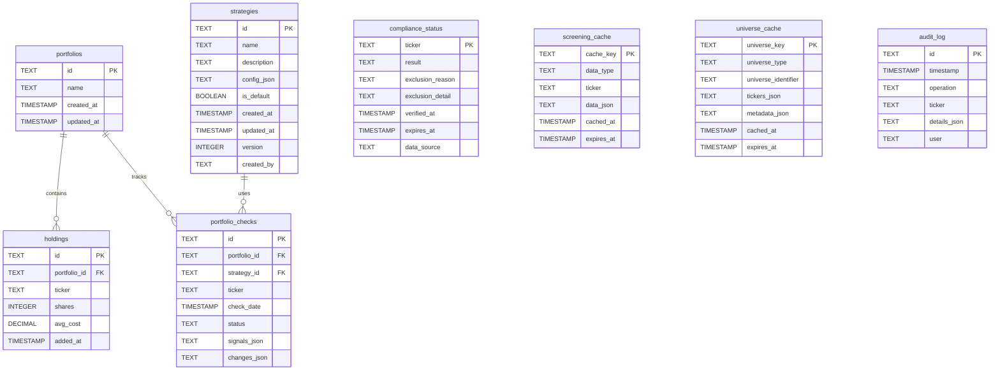

# Technical Requirements Document (TRD)
## stock-friend-cli: Halal-Compliant Stock Screening Tool

**Part 2: Data Models & Service Layer**

---

## Document Navigation

- **Part 1:** Architecture & Foundation
- **Part 2:** Data Models & Service Layer (this document)
- **Part 3:** Indicator Architecture & Specifications
- **Part 4:** Integration, Security & Performance
- **Part 5:** Implementation & Testing Strategy

---

## Phase 4: Domain Models

### 4.1 Core Domain Models

All domain models use Python dataclasses with type hints for immutability and validation. Pydantic models are used where runtime validation is required (user inputs, API responses).

#### 4.1.1 Stock Model

```python
from dataclasses import dataclass, field
from datetime import datetime
from decimal import Decimal
from typing import Optional
from enum import Enum

@dataclass(frozen=True)
class Stock:
    """
    Immutable representation of a stock.

    Design: frozen=True ensures immutability (thread-safe, cacheable)
    """
    ticker: str
    company_name: str
    sector: str
    market_cap: Decimal
    exchange: str  # e.g., "NASDAQ", "NYSE", "LSE"

    # Optional fields
    industry: Optional[str] = None
    country: Optional[str] = None
    currency: str = "USD"

    def __post_init__(self):
        """Validate invariants."""
        if not self.ticker or len(self.ticker) > 10:
            raise ValueError(f"Invalid ticker: {self.ticker}")

        if self.market_cap < 0:
            raise ValueError(f"Market cap cannot be negative: {self.market_cap}")

        # Normalize ticker to uppercase
        object.__setattr__(self, 'ticker', self.ticker.upper())

    def __str__(self) -> str:
        return f"{self.ticker} - {self.company_name} ({self.sector})"


class SectorType(Enum):
    """Standardized sector classifications (GICS Level 1)."""
    TECHNOLOGY = "Technology"
    HEALTHCARE = "Healthcare"
    FINANCIALS = "Financials"
    CONSUMER_DISCRETIONARY = "Consumer Discretionary"
    CONSUMER_STAPLES = "Consumer Staples"
    INDUSTRIALS = "Industrials"
    ENERGY = "Energy"
    REAL_ESTATE = "Real Estate"
    UTILITIES = "Utilities"
    MATERIALS = "Materials"
    COMMUNICATION_SERVICES = "Communication Services"


class ExchangeType(Enum):
    """Supported stock exchanges."""
    SP500 = "S&P 500"
    NASDAQ_100 = "NASDAQ 100"
    NASDAQ_COMPOSITE = "NASDAQ Composite"
    RUSSELL_2000 = "Russell 2000"
    DOW_JONES = "Dow Jones Industrial"
    NYSE = "New York Stock Exchange"
    LSE = "London Stock Exchange"
    EURONEXT = "Euronext"
```

---

#### 4.1.2 Portfolio and Holding Models

```python
from dataclasses import dataclass, field
from typing import List, Optional
from datetime import datetime
from decimal import Decimal
import uuid

@dataclass
class Holding:
    """
    Represents a stock holding within a portfolio.

    Mutable to allow updating shares and cost basis.
    """
    id: str = field(default_factory=lambda: str(uuid.uuid4()))
    ticker: str = field(default="")
    shares: int = field(default=0)
    avg_cost: Decimal = field(default=Decimal("0.00"))
    added_at: datetime = field(default_factory=datetime.now)

    # Calculated fields (not persisted, computed on demand)
    current_price: Optional[Decimal] = field(default=None, repr=False)
    current_value: Optional[Decimal] = field(default=None, repr=False)
    gain_loss: Optional[Decimal] = field(default=None, repr=False)
    gain_loss_pct: Optional[float] = field(default=None, repr=False)

    def __post_init__(self):
        """Validate holding constraints."""
        if not self.ticker:
            raise ValueError("Ticker is required")

        if self.shares < 0:
            raise ValueError(f"Shares cannot be negative: {self.shares}")

        if self.avg_cost < 0:
            raise ValueError(f"Average cost cannot be negative: {self.avg_cost}")

        self.ticker = self.ticker.upper()

    def update_market_data(self, current_price: Decimal):
        """Update calculated fields with current market price."""
        self.current_price = current_price
        self.current_value = current_price * self.shares
        self.gain_loss = (current_price - self.avg_cost) * self.shares
        self.gain_loss_pct = float((current_price - self.avg_cost) / self.avg_cost * 100) if self.avg_cost > 0 else 0.0

    @property
    def total_cost(self) -> Decimal:
        """Total cost basis."""
        return self.avg_cost * self.shares


@dataclass
class Portfolio:
    """
    Collection of stock holdings with metadata.

    Mutable to allow adding/removing holdings.
    """
    id: str = field(default_factory=lambda: str(uuid.uuid4()))
    name: str = field(default="My Portfolio")
    created_at: datetime = field(default_factory=datetime.now)
    updated_at: datetime = field(default_factory=datetime.now)
    holdings: List[Holding] = field(default_factory=list)

    def __post_init__(self):
        """Validate portfolio constraints."""
        if not self.name or len(self.name) > 100:
            raise ValueError(f"Invalid portfolio name: {self.name}")

    @property
    def total_value(self) -> Decimal:
        """Total current value of all holdings."""
        return sum(
            (h.current_value for h in self.holdings if h.current_value),
            Decimal("0.00")
        )

    @property
    def total_cost(self) -> Decimal:
        """Total cost basis of all holdings."""
        return sum(h.total_cost for h in self.holdings)

    @property
    def total_gain_loss(self) -> Decimal:
        """Total gain/loss across all holdings."""
        return self.total_value - self.total_cost if self.total_value else Decimal("0.00")

    @property
    def total_gain_loss_pct(self) -> float:
        """Total gain/loss percentage."""
        if self.total_cost == 0:
            return 0.0
        return float(self.total_gain_loss / self.total_cost * 100)

    def add_holding(self, holding: Holding):
        """Add a holding to portfolio."""
        # Check if ticker already exists
        existing = next((h for h in self.holdings if h.ticker == holding.ticker), None)
        if existing:
            raise ValueError(f"Ticker {holding.ticker} already exists in portfolio. Use update instead.")

        self.holdings.append(holding)
        self.updated_at = datetime.now()

    def remove_holding(self, ticker: str) -> bool:
        """Remove a holding by ticker. Returns True if removed."""
        ticker = ticker.upper()
        initial_count = len(self.holdings)
        self.holdings = [h for h in self.holdings if h.ticker != ticker]

        if len(self.holdings) < initial_count:
            self.updated_at = datetime.now()
            return True
        return False

    def get_holding(self, ticker: str) -> Optional[Holding]:
        """Get holding by ticker."""
        ticker = ticker.upper()
        return next((h for h in self.holdings if h.ticker == ticker), None)
```

---

#### 4.1.3 Strategy Models

```python
from dataclasses import dataclass, field
from typing import List, Dict, Any, Optional
from enum import Enum
from datetime import datetime
import json

class ConditionOperator(Enum):
    """Comparison operators for strategy conditions."""
    EQUALS = "="
    NOT_EQUALS = "!="
    GREATER_THAN = ">"
    LESS_THAN = "<"
    GREATER_EQUAL = ">="
    LESS_EQUAL = "<="
    IN = "in"  # For multi-value checks (e.g., MCDX in ["Banker", "Smart Money"])
    NOT_IN = "not_in"


class LogicOperator(Enum):
    """Logic operators for combining conditions."""
    AND = "AND"
    OR = "OR"


@dataclass
class StrategyCondition:
    """
    Single condition in a strategy.

    Examples:
        MCDX signal in ["Banker", "Smart Money"]
        B-XTrender color = "Green"
        P/E ratio < 30
        Price > SMA(20)
    """
    indicator_name: str  # e.g., "MCDX", "B-XTrender", "SMA", "P/E"
    field: str  # e.g., "signal", "color", "value"
    operator: ConditionOperator
    value: Any  # Could be str, int, float, List[str]

    # Optional: For indicators with parameters (e.g., SMA(20))
    indicator_config: Optional[Dict[str, Any]] = None

    def __post_init__(self):
        """Validate condition."""
        if not self.indicator_name:
            raise ValueError("Indicator name is required")

        if self.operator in [ConditionOperator.IN, ConditionOperator.NOT_IN]:
            if not isinstance(self.value, list):
                raise ValueError(f"Operator {self.operator} requires list value")

    def evaluate(self, signal: Dict[str, Any]) -> bool:
        """
        Evaluate this condition against an indicator signal.

        Args:
            signal: Indicator output, e.g., {"signal": "Banker", "score": 0.15}

        Returns:
            True if condition is met
        """
        signal_value = signal.get(self.field)

        if signal_value is None:
            return False

        if self.operator == ConditionOperator.EQUALS:
            return signal_value == self.value
        elif self.operator == ConditionOperator.NOT_EQUALS:
            return signal_value != self.value
        elif self.operator == ConditionOperator.GREATER_THAN:
            return signal_value > self.value
        elif self.operator == ConditionOperator.LESS_THAN:
            return signal_value < self.value
        elif self.operator == ConditionOperator.GREATER_EQUAL:
            return signal_value >= self.value
        elif self.operator == ConditionOperator.LESS_EQUAL:
            return signal_value <= self.value
        elif self.operator == ConditionOperator.IN:
            return signal_value in self.value
        elif self.operator == ConditionOperator.NOT_IN:
            return signal_value not in self.value

        return False

    def to_human_readable(self) -> str:
        """Convert condition to human-readable string."""
        if self.operator == ConditionOperator.IN:
            return f"{self.indicator_name}.{self.field} in {self.value}"
        else:
            return f"{self.indicator_name}.{self.field} {self.operator.value} {self.value}"


@dataclass
class Strategy:
    """
    Investment strategy composed of multiple conditions.

    All conditions are combined with AND logic at top level.
    Within multi-value checks (IN operator), OR logic applies.

    Example:
        Condition 1: MCDX.signal in ["Banker", "Smart Money"]  (OR within)
        Condition 2: B-XTrender.color = "Green"
        Logic: Condition1 AND Condition2
    """
    id: str = field(default_factory=lambda: str(uuid.uuid4()))
    name: str = field(default="Unnamed Strategy")
    description: str = field(default="")
    conditions: List[StrategyCondition] = field(default_factory=list)
    is_default: bool = field(default=False)
    created_at: datetime = field(default_factory=datetime.now)
    updated_at: datetime = field(default_factory=datetime.now)

    # Metadata
    version: int = field(default=1)
    created_by: str = field(default="user")

    def __post_init__(self):
        """Validate strategy."""
        if not self.name or len(self.name) > 100:
            raise ValueError(f"Invalid strategy name: {self.name}")

        if not self.conditions:
            raise ValueError("Strategy must have at least one condition")

    def evaluate_all_conditions(self, indicator_signals: Dict[str, Dict[str, Any]]) -> bool:
        """
        Evaluate all strategy conditions (AND logic).

        Args:
            indicator_signals: Dict mapping indicator names to their signals
                Example: {
                    "MCDX": {"signal": "Banker", "score": 0.15},
                    "B-XTrender": {"color": "Green", "momentum": 0.08}
                }

        Returns:
            True if ALL conditions are met
        """
        for condition in self.conditions:
            signal = indicator_signals.get(condition.indicator_name)

            if signal is None:
                # Indicator not calculated
                return False

            if not condition.evaluate(signal):
                return False

        return True  # All conditions met

    def to_dict(self) -> Dict[str, Any]:
        """Serialize strategy to dictionary (for JSON storage)."""
        return {
            "id": self.id,
            "name": self.name,
            "description": self.description,
            "conditions": [
                {
                    "indicator_name": c.indicator_name,
                    "field": c.field,
                    "operator": c.operator.value,
                    "value": c.value,
                    "indicator_config": c.indicator_config
                }
                for c in self.conditions
            ],
            "is_default": self.is_default,
            "created_at": self.created_at.isoformat(),
            "updated_at": self.updated_at.isoformat(),
            "version": self.version,
            "created_by": self.created_by
        }

    @staticmethod
    def from_dict(data: Dict[str, Any]) -> 'Strategy':
        """Deserialize strategy from dictionary."""
        conditions = [
            StrategyCondition(
                indicator_name=c["indicator_name"],
                field=c["field"],
                operator=ConditionOperator(c["operator"]),
                value=c["value"],
                indicator_config=c.get("indicator_config")
            )
            for c in data["conditions"]
        ]

        return Strategy(
            id=data["id"],
            name=data["name"],
            description=data.get("description", ""),
            conditions=conditions,
            is_default=data.get("is_default", False),
            created_at=datetime.fromisoformat(data["created_at"]),
            updated_at=datetime.fromisoformat(data["updated_at"]),
            version=data.get("version", 1),
            created_by=data.get("created_by", "user")
        )
```

---

#### 4.1.4 Screening Result Models

```python
from dataclasses import dataclass, field
from typing import List, Dict, Any, Optional
from datetime import datetime
from decimal import Decimal

@dataclass
class IndicatorSignal:
    """Output from a technical indicator."""
    indicator_name: str
    signal_value: Any  # "Banker", "Green", 0.15, etc.
    timestamp: datetime
    additional_data: Dict[str, Any] = field(default_factory=dict)

    def __str__(self) -> str:
        return f"{self.indicator_name}: {self.signal_value}"


@dataclass
class StockMatch:
    """
    Stock that matches strategy criteria.

    Includes all indicator signals and enriched fundamental data.
    """
    ticker: str
    company_name: str
    sector: str
    exchange: str

    # Indicator signals that matched
    indicator_signals: Dict[str, IndicatorSignal]

    # Match confidence (0.0 to 1.0)
    match_confidence: float = 1.0

    # Current market data
    current_price: Optional[Decimal] = None
    daily_change_pct: Optional[float] = None

    # Fundamental data (optional enrichment)
    pe_ratio: Optional[float] = None
    eps: Optional[Decimal] = None
    market_cap: Optional[Decimal] = None
    volume: Optional[int] = None

    # EU accessibility
    eu_accessible: bool = True
    eu_accessibility_note: Optional[str] = None

    def __post_init__(self):
        """Validate match."""
        if not self.ticker:
            raise ValueError("Ticker is required")

        if not 0.0 <= self.match_confidence <= 1.0:
            raise ValueError(f"Match confidence must be 0.0-1.0: {self.match_confidence}")

    @property
    def match_confidence_pct(self) -> int:
        """Match confidence as percentage (0-100)."""
        return int(self.match_confidence * 100)


@dataclass
class StockExclusion:
    """
    Stock excluded from screening (halal compliance failure).
    """
    ticker: str
    company_name: Optional[str] = None
    exclusion_reason: str = "UNVERIFIED"  # Reason code
    exclusion_detail: Optional[str] = None  # Human-readable detail
    timestamp: datetime = field(default_factory=datetime.now)

    def __str__(self) -> str:
        if self.company_name:
            return f"{self.ticker} ({self.company_name}) - Excluded: {self.exclusion_reason}"
        return f"{self.ticker} - Excluded: {self.exclusion_reason}"


@dataclass
class ScreeningResult:
    """
    Complete result from a screening operation.

    Contains matches, exclusions, and metadata about the screening.
    """
    # Universe information
    universe_description: str  # "S&P 500", "Technology Sector", etc.
    universe_type: str  # "exchange", "sector", "etf", "custom"

    # Strategy applied
    strategy_id: str
    strategy_name: str

    # Timing
    timestamp: datetime
    processing_time_seconds: float

    # Counts
    total_stocks: int
    compliant_stocks: int
    excluded_stocks: int
    matches_count: int

    # Results
    matches: List[StockMatch] = field(default_factory=list)
    exclusions: List[StockExclusion] = field(default_factory=list)

    # Errors (if any stocks failed to process)
    errors: List[Dict[str, str]] = field(default_factory=list)

    def __post_init__(self):
        """Validate result consistency."""
        if self.total_stocks != self.compliant_stocks + self.excluded_stocks:
            raise ValueError("Total stocks != compliant + excluded")

        if self.matches_count != len(self.matches):
            raise ValueError("Matches count != len(matches)")

    @property
    def compliance_rate(self) -> float:
        """Percentage of stocks that passed halal screening."""
        if self.total_stocks == 0:
            return 0.0
        return (self.compliant_stocks / self.total_stocks) * 100

    @property
    def match_rate(self) -> float:
        """Percentage of compliant stocks that matched strategy."""
        if self.compliant_stocks == 0:
            return 0.0
        return (self.matches_count / self.compliant_stocks) * 100

    def summary(self) -> str:
        """Human-readable summary."""
        return (
            f"Screened {self.total_stocks} stocks from {self.universe_description}\n"
            f"Halal Compliant: {self.compliant_stocks} ({self.compliance_rate:.1f}%)\n"
            f"Excluded: {self.excluded_stocks}\n"
            f"Strategy Matches: {self.matches_count} ({self.match_rate:.1f}% of compliant)\n"
            f"Processing Time: {self.processing_time_seconds:.2f}s"
        )
```

---

#### 4.1.5 Universe Configuration Models

```python
from dataclasses import dataclass
from typing import Optional, List
from enum import Enum
from decimal import Decimal

class UniverseType(Enum):
    """Types of stock universes for screening."""
    EXCHANGE = "exchange"
    SECTOR = "sector"
    MARKET_CAP = "market_cap"
    ETF = "etf"
    CUSTOM = "custom"


@dataclass
class UniverseConfig:
    """
    Configuration specifying which stocks to screen.

    Only one of the optional fields should be set based on universe_type.
    """
    universe_type: UniverseType

    # Exchange/Index screening
    exchange: Optional[ExchangeType] = None

    # Sector screening
    sector: Optional[SectorType] = None

    # Market cap screening
    min_market_cap: Optional[Decimal] = None
    max_market_cap: Optional[Decimal] = None

    # ETF screening
    etf_ticker: Optional[str] = None
    min_etf_weight: Optional[float] = None  # Minimum weight in ETF (e.g., 0.01 = 1%)

    # Custom list screening
    custom_tickers: Optional[List[str]] = None

    def __post_init__(self):
        """Validate configuration consistency."""
        if self.universe_type == UniverseType.EXCHANGE:
            if not self.exchange:
                raise ValueError("Exchange type requires 'exchange' field")

        elif self.universe_type == UniverseType.SECTOR:
            if not self.sector:
                raise ValueError("Sector type requires 'sector' field")

        elif self.universe_type == UniverseType.MARKET_CAP:
            if self.min_market_cap is None and self.max_market_cap is None:
                raise ValueError("Market cap type requires min or max market cap")
            if self.min_market_cap and self.max_market_cap:
                if self.min_market_cap > self.max_market_cap:
                    raise ValueError("min_market_cap cannot exceed max_market_cap")

        elif self.universe_type == UniverseType.ETF:
            if not self.etf_ticker:
                raise ValueError("ETF type requires 'etf_ticker' field")

        elif self.universe_type == UniverseType.CUSTOM:
            if not self.custom_tickers:
                raise ValueError("Custom type requires 'custom_tickers' field")

    def get_description(self) -> str:
        """Human-readable description of universe."""
        if self.universe_type == UniverseType.EXCHANGE:
            return self.exchange.value

        elif self.universe_type == UniverseType.SECTOR:
            return f"{self.sector.value} Sector"

        elif self.universe_type == UniverseType.MARKET_CAP:
            if self.min_market_cap and self.max_market_cap:
                return f"Market Cap: ${self.min_market_cap/1e9:.1f}B - ${self.max_market_cap/1e9:.1f}B"
            elif self.min_market_cap:
                return f"Market Cap > ${self.min_market_cap/1e9:.1f}B"
            else:
                return f"Market Cap < ${self.max_market_cap/1e9:.1f}B"

        elif self.universe_type == UniverseType.ETF:
            return f"{self.etf_ticker} Holdings"

        elif self.universe_type == UniverseType.CUSTOM:
            return f"Custom List ({len(self.custom_tickers)} stocks)"

        return "Unknown Universe"
```

---

#### 4.1.6 Compliance and Fundamental Data Models

```python
from dataclasses import dataclass
from typing import Optional
from datetime import datetime
from decimal import Decimal
from enum import Enum

class ComplianceResult(Enum):
    """Halal compliance result."""
    COMPLIANT = "compliant"
    EXCLUDED = "excluded"
    UNVERIFIED = "unverified"
    ERROR = "error"


@dataclass(frozen=True)
class ComplianceStatus:
    """
    Halal compliance status for a stock.

    Immutable to ensure cached compliance data is not modified.
    """
    ticker: str
    result: ComplianceResult
    exclusion_reason: Optional[str] = None  # Reason code (DEFENSE, GAMBLING, etc.)
    exclusion_detail: Optional[str] = None  # Human-readable explanation
    verified_at: datetime = field(default_factory=datetime.now)
    data_source: str = "API"  # "API", "CACHE", "MANUAL"

    @property
    def is_compliant(self) -> bool:
        """Check if stock is halal compliant."""
        return self.result == ComplianceResult.COMPLIANT

    @staticmethod
    def compliant(ticker: str, verified_at: datetime = None, source: str = "API") -> 'ComplianceStatus':
        """Factory method for compliant status."""
        return ComplianceStatus(
            ticker=ticker,
            result=ComplianceResult.COMPLIANT,
            verified_at=verified_at or datetime.now(),
            data_source=source
        )

    @staticmethod
    def excluded(ticker: str, reason: str, detail: str = None, source: str = "API") -> 'ComplianceStatus':
        """Factory method for excluded status."""
        return ComplianceStatus(
            ticker=ticker,
            result=ComplianceResult.EXCLUDED,
            exclusion_reason=reason,
            exclusion_detail=detail,
            verified_at=datetime.now(),
            data_source=source
        )


@dataclass
class FundamentalData:
    """
    Fundamental financial metrics for a stock.

    Mutable as this data is frequently updated.
    """
    ticker: str

    # Valuation metrics
    pe_ratio: Optional[float] = None
    pb_ratio: Optional[float] = None
    ps_ratio: Optional[float] = None
    peg_ratio: Optional[float] = None

    # Per-share metrics
    eps: Optional[Decimal] = None
    eps_growth_yoy: Optional[float] = None  # Year-over-year growth %
    book_value_per_share: Optional[Decimal] = None

    # Profitability
    revenue: Optional[Decimal] = None
    revenue_growth_yoy: Optional[float] = None
    net_income: Optional[Decimal] = None
    profit_margin: Optional[float] = None
    roe: Optional[float] = None  # Return on Equity

    # Balance sheet
    total_assets: Optional[Decimal] = None
    total_debt: Optional[Decimal] = None
    total_cash: Optional[Decimal] = None
    debt_to_equity: Optional[float] = None

    # Shariah ratios (Phase 2)
    debt_to_market_cap: Optional[float] = None
    cash_to_market_cap: Optional[float] = None
    accounts_receivable_to_assets: Optional[float] = None
    impure_income_percentage: Optional[float] = None

    # Metadata
    fiscal_year_end: Optional[datetime] = None
    last_updated: datetime = field(default_factory=datetime.now)

    def __post_init__(self):
        """Validate fundamental data."""
        if not self.ticker:
            raise ValueError("Ticker is required")

    def is_complete(self) -> bool:
        """Check if essential fundamental data is available."""
        return all([
            self.pe_ratio is not None,
            self.eps is not None,
            self.revenue is not None
        ])
```

---

### 4.2 Validation and Serialization Patterns

#### 4.2.1 Pydantic Models for API Validation

```python
from pydantic import BaseModel, Field, validator, root_validator
from typing import List, Optional
from decimal import Decimal
from datetime import datetime

class CreateHoldingRequest(BaseModel):
    """Request model for creating a new holding (user input validation)."""
    ticker: str = Field(..., min_length=1, max_length=10, description="Stock ticker symbol")
    shares: int = Field(..., gt=0, description="Number of shares")
    avg_cost: Decimal = Field(..., ge=0, description="Average cost per share")

    @validator('ticker')
    def ticker_uppercase(cls, v):
        """Normalize ticker to uppercase."""
        return v.upper().strip()

    @validator('ticker')
    def ticker_alphanumeric(cls, v):
        """Validate ticker contains only alphanumeric characters."""
        if not v.replace('.', '').isalnum():
            raise ValueError("Ticker must be alphanumeric")
        return v


class CreateStrategyRequest(BaseModel):
    """Request model for creating a strategy."""
    name: str = Field(..., min_length=1, max_length=100)
    description: str = Field(default="", max_length=500)
    conditions: List[Dict] = Field(..., min_items=1)

    @validator('conditions')
    def validate_conditions(cls, v):
        """Validate condition structure."""
        for condition in v:
            required_fields = ['indicator_name', 'field', 'operator', 'value']
            if not all(field in condition for field in required_fields):
                raise ValueError(f"Condition missing required fields: {required_fields}")
        return v


class ScreeningRequest(BaseModel):
    """Request model for initiating a screening operation."""
    universe_type: str = Field(..., description="Type of universe to screen")
    strategy_id: str = Field(..., description="ID of strategy to apply")

    # Optional universe parameters
    exchange: Optional[str] = None
    sector: Optional[str] = None
    etf_ticker: Optional[str] = None
    custom_tickers: Optional[List[str]] = None

    @root_validator
    def check_universe_params(cls, values):
        """Validate universe parameters match universe type."""
        universe_type = values.get('universe_type')

        if universe_type == 'exchange' and not values.get('exchange'):
            raise ValueError("Exchange type requires 'exchange' parameter")

        if universe_type == 'sector' and not values.get('sector'):
            raise ValueError("Sector type requires 'sector' parameter")

        if universe_type == 'etf' and not values.get('etf_ticker'):
            raise ValueError("ETF type requires 'etf_ticker' parameter")

        if universe_type == 'custom' and not values.get('custom_tickers'):
            raise ValueError("Custom type requires 'custom_tickers' parameter")

        return values
```

---

## Phase 5: Database Schema Design

### 5.1 Complete SQLite Schema

```sql
-- ============================================================================
-- stock-friend-cli Database Schema
-- SQLite 3.x
-- ============================================================================

-- Enable foreign key constraints
PRAGMA foreign_keys = ON;

-- ============================================================================
-- Table: portfolios
-- Stores user portfolio metadata
-- ============================================================================
CREATE TABLE IF NOT EXISTS portfolios (
    id TEXT PRIMARY KEY,
    name TEXT NOT NULL,
    created_at TIMESTAMP NOT NULL DEFAULT CURRENT_TIMESTAMP,
    updated_at TIMESTAMP NOT NULL DEFAULT CURRENT_TIMESTAMP,

    CONSTRAINT name_length CHECK (length(name) > 0 AND length(name) <= 100)
);

CREATE INDEX idx_portfolios_created_at ON portfolios(created_at DESC);
CREATE INDEX idx_portfolios_name ON portfolios(name);

-- ============================================================================
-- Table: holdings
-- Stores individual stock holdings within portfolios
-- ============================================================================
CREATE TABLE IF NOT EXISTS holdings (
    id TEXT PRIMARY KEY,
    portfolio_id TEXT NOT NULL,
    ticker TEXT NOT NULL,
    shares INTEGER NOT NULL CHECK (shares >= 0),
    avg_cost DECIMAL(12, 4) NOT NULL CHECK (avg_cost >= 0),
    added_at TIMESTAMP NOT NULL DEFAULT CURRENT_TIMESTAMP,

    FOREIGN KEY (portfolio_id) REFERENCES portfolios(id) ON DELETE CASCADE,
    CONSTRAINT unique_portfolio_ticker UNIQUE (portfolio_id, ticker)
);

CREATE INDEX idx_holdings_portfolio_id ON holdings(portfolio_id);
CREATE INDEX idx_holdings_ticker ON holdings(ticker);
CREATE INDEX idx_holdings_added_at ON holdings(added_at DESC);

-- ============================================================================
-- Table: strategies
-- Stores investment strategy configurations
-- ============================================================================
CREATE TABLE IF NOT EXISTS strategies (
    id TEXT PRIMARY KEY,
    name TEXT NOT NULL,
    description TEXT,
    config_json TEXT NOT NULL,  -- JSON serialized strategy conditions
    is_default BOOLEAN NOT NULL DEFAULT 0,
    created_at TIMESTAMP NOT NULL DEFAULT CURRENT_TIMESTAMP,
    updated_at TIMESTAMP NOT NULL DEFAULT CURRENT_TIMESTAMP,
    version INTEGER NOT NULL DEFAULT 1,
    created_by TEXT NOT NULL DEFAULT 'user',

    CONSTRAINT name_length CHECK (length(name) > 0 AND length(name) <= 100),
    CONSTRAINT valid_json CHECK (json_valid(config_json))
);

CREATE INDEX idx_strategies_name ON strategies(name);
CREATE INDEX idx_strategies_is_default ON strategies(is_default);
CREATE INDEX idx_strategies_created_at ON strategies(created_at DESC);

-- Ensure only one default strategy
CREATE UNIQUE INDEX idx_strategies_single_default ON strategies(is_default) WHERE is_default = 1;

-- ============================================================================
-- Table: compliance_status
-- Caches halal compliance status for stocks
-- ============================================================================
CREATE TABLE IF NOT EXISTS compliance_status (
    ticker TEXT PRIMARY KEY,
    result TEXT NOT NULL,  -- 'compliant', 'excluded', 'unverified', 'error'
    exclusion_reason TEXT,  -- Reason code (DEFENSE, GAMBLING, etc.)
    exclusion_detail TEXT,  -- Human-readable detail
    verified_at TIMESTAMP NOT NULL DEFAULT CURRENT_TIMESTAMP,
    expires_at TIMESTAMP NOT NULL,  -- TTL: verified_at + 30 days
    data_source TEXT NOT NULL DEFAULT 'API',  -- 'API', 'CACHE', 'MANUAL'

    CONSTRAINT valid_result CHECK (result IN ('compliant', 'excluded', 'unverified', 'error'))
);

CREATE INDEX idx_compliance_result ON compliance_status(result);
CREATE INDEX idx_compliance_expires_at ON compliance_status(expires_at);
CREATE INDEX idx_compliance_verified_at ON compliance_status(verified_at DESC);

-- ============================================================================
-- Table: screening_cache
-- Caches stock market data (OHLCV, fundamentals)
-- ============================================================================
CREATE TABLE IF NOT EXISTS screening_cache (
    cache_key TEXT PRIMARY KEY,  -- Format: "stock:{ticker}:ohlcv" or "stock:{ticker}:fundamental"
    data_type TEXT NOT NULL,  -- 'ohlcv', 'fundamental', 'indicator'
    ticker TEXT NOT NULL,
    data_json TEXT NOT NULL,  -- JSON serialized data
    cached_at TIMESTAMP NOT NULL DEFAULT CURRENT_TIMESTAMP,
    expires_at TIMESTAMP NOT NULL,  -- TTL varies by data type

    CONSTRAINT valid_json CHECK (json_valid(data_json))
);

CREATE INDEX idx_cache_ticker ON screening_cache(ticker);
CREATE INDEX idx_cache_data_type ON screening_cache(data_type);
CREATE INDEX idx_cache_expires_at ON screening_cache(expires_at);

-- ============================================================================
-- Table: universe_cache
-- Caches stock universe lists (exchange constituents, ETF holdings)
-- ============================================================================
CREATE TABLE IF NOT EXISTS universe_cache (
    universe_key TEXT PRIMARY KEY,  -- Format: "exchange:SP500" or "etf:SPY"
    universe_type TEXT NOT NULL,  -- 'exchange', 'sector', 'etf', 'market_cap'
    universe_identifier TEXT NOT NULL,  -- "SP500", "Technology", "SPY", etc.
    tickers_json TEXT NOT NULL,  -- JSON array of tickers
    metadata_json TEXT,  -- Optional metadata (e.g., ETF weights)
    cached_at TIMESTAMP NOT NULL DEFAULT CURRENT_TIMESTAMP,
    expires_at TIMESTAMP NOT NULL,  -- TTL: 30 days for most universes

    CONSTRAINT valid_tickers_json CHECK (json_valid(tickers_json))
);

CREATE INDEX idx_universe_type ON universe_cache(universe_type);
CREATE INDEX idx_universe_expires_at ON universe_cache(expires_at);

-- ============================================================================
-- Table: portfolio_checks
-- Audit trail of portfolio strategy checks
-- ============================================================================
CREATE TABLE IF NOT EXISTS portfolio_checks (
    id TEXT PRIMARY KEY,
    portfolio_id TEXT NOT NULL,
    strategy_id TEXT NOT NULL,
    ticker TEXT NOT NULL,
    check_date TIMESTAMP NOT NULL DEFAULT CURRENT_TIMESTAMP,

    -- Results
    status TEXT NOT NULL,  -- 'BUY_SIGNAL_MAINTAINED', 'SIGNAL_WEAKENING', 'SIGNAL_LOST'
    signals_json TEXT NOT NULL,  -- JSON of indicator signals at check time

    -- Changes from previous check
    changes_json TEXT,  -- JSON of detected changes

    FOREIGN KEY (portfolio_id) REFERENCES portfolios(id) ON DELETE CASCADE,
    FOREIGN KEY (strategy_id) REFERENCES strategies(id),

    CONSTRAINT valid_signals_json CHECK (json_valid(signals_json))
);

CREATE INDEX idx_portfolio_checks_portfolio ON portfolio_checks(portfolio_id, check_date DESC);
CREATE INDEX idx_portfolio_checks_ticker ON portfolio_checks(ticker, check_date DESC);

-- ============================================================================
-- Table: audit_log
-- Audit trail for halal exclusions and critical operations
-- ============================================================================
CREATE TABLE IF NOT EXISTS audit_log (
    id TEXT PRIMARY KEY,
    timestamp TIMESTAMP NOT NULL DEFAULT CURRENT_TIMESTAMP,
    operation TEXT NOT NULL,  -- 'HALAL_EXCLUSION', 'STRATEGY_CREATE', etc.
    ticker TEXT,  -- If operation involves a stock
    details_json TEXT NOT NULL,  -- JSON with operation details
    user TEXT NOT NULL DEFAULT 'system',

    CONSTRAINT valid_details_json CHECK (json_valid(details_json))
);

CREATE INDEX idx_audit_timestamp ON audit_log(timestamp DESC);
CREATE INDEX idx_audit_operation ON audit_log(operation);
CREATE INDEX idx_audit_ticker ON audit_log(ticker);

-- ============================================================================
-- Views for convenience
-- ============================================================================

-- View: portfolio_summary
-- Aggregates portfolio holdings with calculated totals
CREATE VIEW IF NOT EXISTS portfolio_summary AS
SELECT
    p.id AS portfolio_id,
    p.name AS portfolio_name,
    COUNT(h.id) AS holdings_count,
    SUM(h.shares * h.avg_cost) AS total_cost_basis,
    p.created_at,
    p.updated_at
FROM portfolios p
LEFT JOIN holdings h ON p.id = h.portfolio_id
GROUP BY p.id, p.name, p.created_at, p.updated_at;

-- View: active_strategies
-- Lists non-archived strategies
CREATE VIEW IF NOT EXISTS active_strategies AS
SELECT
    id,
    name,
    description,
    is_default,
    created_at,
    updated_at,
    version
FROM strategies
ORDER BY is_default DESC, name ASC;

-- ============================================================================
-- Triggers for automatic timestamp updates
-- ============================================================================

-- Trigger: update_portfolios_timestamp
CREATE TRIGGER IF NOT EXISTS update_portfolios_timestamp
AFTER UPDATE ON portfolios
FOR EACH ROW
BEGIN
    UPDATE portfolios SET updated_at = CURRENT_TIMESTAMP WHERE id = OLD.id;
END;

-- Trigger: update_strategies_timestamp
CREATE TRIGGER IF NOT EXISTS update_strategies_timestamp
AFTER UPDATE ON strategies
FOR EACH ROW
BEGIN
    UPDATE strategies SET updated_at = CURRENT_TIMESTAMP WHERE id = OLD.id;
END;

-- ============================================================================
-- Initial data: Default Momentum Strategy
-- ============================================================================
INSERT OR IGNORE INTO strategies (id, name, description, config_json, is_default, version) VALUES (
    'default-momentum-strategy',
    'Default Momentum Strategy',
    'Dual-indicator confirmation for institutional accumulation (MCDX + B-XTrender)',
    json('{
        "conditions": [
            {
                "indicator_name": "MCDX",
                "field": "signal",
                "operator": "in",
                "value": ["Banker", "Smart Money"]
            },
            {
                "indicator_name": "B-XTrender",
                "field": "color",
                "operator": "=",
                "value": "Green"
            }
        ]
    }'),
    1,
    1
);
```

---

### 5.2 Database ER Diagram



---

### 5.3 Indexing Strategy

**Performance Optimization via Strategic Indexing:**

| Table | Index | Purpose | Query Pattern |
|-------|-------|---------|---------------|
| `portfolios` | `idx_portfolios_created_at` | List portfolios by creation date | `SELECT * FROM portfolios ORDER BY created_at DESC` |
| `portfolios` | `idx_portfolios_name` | Search portfolios by name | `SELECT * FROM portfolios WHERE name LIKE '%..%'` |
| `holdings` | `idx_holdings_portfolio_id` | Retrieve holdings for a portfolio | `SELECT * FROM holdings WHERE portfolio_id = ?` |
| `holdings` | `idx_holdings_ticker` | Find holdings by ticker across portfolios | `SELECT * FROM holdings WHERE ticker = ?` |
| `strategies` | `idx_strategies_is_default` | Quick lookup of default strategy | `SELECT * FROM strategies WHERE is_default = 1` |
| `compliance_status` | `idx_compliance_result` | Filter by compliance result | `SELECT * FROM compliance_status WHERE result = 'excluded'` |
| `compliance_status` | `idx_compliance_expires_at` | Cleanup expired cache entries | `DELETE FROM compliance_status WHERE expires_at < ?` |
| `screening_cache` | `idx_cache_ticker` | Retrieve cached data for ticker | `SELECT * FROM screening_cache WHERE ticker = ?` |
| `screening_cache` | `idx_cache_expires_at` | Cleanup expired cache entries | `DELETE FROM screening_cache WHERE expires_at < ?` |
| `portfolio_checks` | `idx_portfolio_checks_portfolio` | Retrieve check history for portfolio | `SELECT * FROM portfolio_checks WHERE portfolio_id = ? ORDER BY check_date DESC` |

**Index Maintenance:**

```python
def cleanup_expired_cache(db_conn):
    """Remove expired cache entries to prevent database bloat."""

    now = datetime.now()

    # Cleanup expired compliance status
    db_conn.execute("DELETE FROM compliance_status WHERE expires_at < ?", (now,))

    # Cleanup expired screening cache
    db_conn.execute("DELETE FROM screening_cache WHERE expires_at < ?", (now,))

    # Cleanup expired universe cache
    db_conn.execute("DELETE FROM universe_cache WHERE expires_at < ?", (now,))

    db_conn.commit()

    # Vacuum to reclaim space
    db_conn.execute("VACUUM")
```

---

### 5.4 Database Initialization Script

```python
import sqlite3
from pathlib import Path
from datetime import datetime, timedelta
import logging

logger = logging.getLogger(__name__)

class DatabaseInitializer:
    """Initialize and migrate database schema."""

    def __init__(self, db_path: str):
        self.db_path = db_path
        self.schema_version = 1

    def initialize(self):
        """Create database and tables if they don't exist."""

        db_file = Path(self.db_path)
        is_new_db = not db_file.exists()

        conn = sqlite3.connect(self.db_path)
        conn.row_factory = sqlite3.Row

        try:
            if is_new_db:
                logger.info(f"Creating new database at {self.db_path}")
                self._create_schema(conn)
                self._insert_default_data(conn)
                logger.info("Database initialized successfully")
            else:
                logger.info(f"Database exists at {self.db_path}")
                self._verify_schema(conn)

        except Exception as e:
            logger.error(f"Database initialization failed: {e}")
            raise

        finally:
            conn.close()

    def _create_schema(self, conn: sqlite3.Connection):
        """Execute schema creation SQL."""

        # Read schema from file
        schema_file = Path(__file__).parent / "schema.sql"
        with open(schema_file, 'r') as f:
            schema_sql = f.read()

        # Execute schema (handles multi-statement SQL)
        conn.executescript(schema_sql)
        conn.commit()

    def _verify_schema(self, conn: sqlite3.Connection):
        """Verify all expected tables exist."""

        expected_tables = [
            'portfolios', 'holdings', 'strategies',
            'compliance_status', 'screening_cache', 'universe_cache',
            'portfolio_checks', 'audit_log'
        ]

        cursor = conn.execute(
            "SELECT name FROM sqlite_master WHERE type='table' AND name NOT LIKE 'sqlite_%'"
        )
        existing_tables = {row[0] for row in cursor.fetchall()}

        missing = set(expected_tables) - existing_tables
        if missing:
            raise RuntimeError(f"Missing tables in database: {missing}")

        logger.info("Schema verification passed")

    def _insert_default_data(self, conn: sqlite3.Connection):
        """Insert default strategy and initial configuration."""

        # Default momentum strategy already inserted via schema.sql
        # Verify it exists
        cursor = conn.execute(
            "SELECT id FROM strategies WHERE id = 'default-momentum-strategy'"
        )
        if not cursor.fetchone():
            logger.warning("Default strategy not found after initialization")

    def migrate(self, target_version: int = None):
        """
        Migrate database schema to target version.

        Phase 2: Implement migration logic for schema updates.
        """
        conn = sqlite3.connect(self.db_path)

        try:
            current_version = self._get_schema_version(conn)
            target = target_version or self.schema_version

            if current_version >= target:
                logger.info(f"Database already at version {current_version}")
                return

            logger.info(f"Migrating database from v{current_version} to v{target}")

            # Apply migrations sequentially
            for version in range(current_version + 1, target + 1):
                self._apply_migration(conn, version)

            self._set_schema_version(conn, target)
            logger.info(f"Migration completed to version {target}")

        finally:
            conn.close()

    def _get_schema_version(self, conn: sqlite3.Connection) -> int:
        """Get current schema version from database."""

        # Check if version table exists
        cursor = conn.execute(
            "SELECT name FROM sqlite_master WHERE type='table' AND name='schema_version'"
        )

        if not cursor.fetchone():
            # Version table doesn't exist, assume version 1
            return 1

        cursor = conn.execute("SELECT MAX(version) FROM schema_version")
        row = cursor.fetchone()
        return row[0] if row[0] else 1

    def _set_schema_version(self, conn: sqlite3.Connection, version: int):
        """Record schema version in database."""

        conn.execute(
            """
            CREATE TABLE IF NOT EXISTS schema_version (
                version INTEGER PRIMARY KEY,
                applied_at TIMESTAMP NOT NULL DEFAULT CURRENT_TIMESTAMP
            )
            """
        )

        conn.execute(
            "INSERT INTO schema_version (version) VALUES (?)",
            (version,)
        )
        conn.commit()

    def _apply_migration(self, conn: sqlite3.Connection, version: int):
        """Apply a specific migration."""

        migration_file = Path(__file__).parent / f"migrations/v{version}.sql"

        if not migration_file.exists():
            raise FileNotFoundError(f"Migration file not found: {migration_file}")

        logger.info(f"Applying migration v{version}")

        with open(migration_file, 'r') as f:
            migration_sql = f.read()

        conn.executescript(migration_sql)
        conn.commit()


# Usage
if __name__ == "__main__":
    logging.basicConfig(level=logging.INFO)

    db_init = DatabaseInitializer("data/stock-friend.db")
    db_init.initialize()
```

---

## Phase 6: JSON Configuration Schemas

### 6.1 Strategy Configuration Schema

```json
{
  "$schema": "http://json-schema.org/draft-07/schema#",
  "title": "Investment Strategy Configuration",
  "type": "object",
  "required": ["id", "name", "conditions"],
  "properties": {
    "id": {
      "type": "string",
      "description": "Unique strategy identifier (UUID)",
      "pattern": "^[a-f0-9-]{36}$"
    },
    "name": {
      "type": "string",
      "minLength": 1,
      "maxLength": 100,
      "description": "Human-readable strategy name"
    },
    "description": {
      "type": "string",
      "maxLength": 500,
      "description": "Optional strategy description"
    },
    "conditions": {
      "type": "array",
      "minItems": 1,
      "description": "List of strategy conditions (AND logic)",
      "items": {
        "type": "object",
        "required": ["indicator_name", "field", "operator", "value"],
        "properties": {
          "indicator_name": {
            "type": "string",
            "enum": ["MCDX", "B-XTrender", "SMA", "RSI", "MACD", "P/E", "EPS"],
            "description": "Name of indicator or fundamental metric"
          },
          "field": {
            "type": "string",
            "description": "Field to evaluate (e.g., 'signal', 'color', 'value')"
          },
          "operator": {
            "type": "string",
            "enum": ["=", "!=", ">", "<", ">=", "<=", "in", "not_in"],
            "description": "Comparison operator"
          },
          "value": {
            "oneOf": [
              {"type": "string"},
              {"type": "number"},
              {"type": "array", "items": {"type": "string"}}
            ],
            "description": "Value to compare against"
          },
          "indicator_config": {
            "type": "object",
            "description": "Optional indicator configuration (e.g., SMA period)",
            "additionalProperties": true
          }
        }
      }
    },
    "is_default": {
      "type": "boolean",
      "default": false,
      "description": "Whether this is the default strategy"
    },
    "created_at": {
      "type": "string",
      "format": "date-time"
    },
    "updated_at": {
      "type": "string",
      "format": "date-time"
    },
    "version": {
      "type": "integer",
      "minimum": 1,
      "default": 1
    },
    "created_by": {
      "type": "string",
      "default": "user"
    }
  }
}
```

**Example Strategy Configuration:**

```json
{
  "id": "default-momentum-strategy",
  "name": "Default Momentum Strategy",
  "description": "Dual-indicator confirmation for institutional accumulation",
  "conditions": [
    {
      "indicator_name": "MCDX",
      "field": "signal",
      "operator": "in",
      "value": ["Banker", "Smart Money"],
      "indicator_config": {
        "volume_period": 20,
        "threshold_banker": 0.10,
        "threshold_smart_money": 0.02
      }
    },
    {
      "indicator_name": "B-XTrender",
      "field": "color",
      "operator": "=",
      "value": "Green",
      "indicator_config": {
        "ema_fast_period": 12,
        "ema_slow_period": 26
      }
    }
  ],
  "is_default": true,
  "created_at": "2025-01-15T10:00:00Z",
  "updated_at": "2025-01-15T10:00:00Z",
  "version": 1,
  "created_by": "user"
}
```

---

### 6.2 Application Settings Schema

```json
{
  "$schema": "http://json-schema.org/draft-07/schema#",
  "title": "Application Settings",
  "type": "object",
  "properties": {
    "database": {
      "type": "object",
      "properties": {
        "path": {
          "type": "string",
          "default": "data/stock-friend.db"
        },
        "auto_vacuum": {
          "type": "boolean",
          "default": true
        }
      }
    },
    "api_keys": {
      "type": "object",
      "properties": {
        "yahoo_finance": {
          "type": "string",
          "description": "Yahoo Finance API key (if required)"
        },
        "zoya_api_key": {
          "type": "string",
          "description": "Zoya halal screening API key"
        },
        "musaffa_api_key": {
          "type": "string",
          "description": "Musaffa halal screening API key"
        }
      }
    },
    "cache": {
      "type": "object",
      "properties": {
        "memory_cache_max_mb": {
          "type": "integer",
          "minimum": 10,
          "maximum": 1000,
          "default": 100
        },
        "ttl": {
          "type": "object",
          "properties": {
            "stock_ohlcv_hours": {"type": "integer", "default": 1},
            "fundamental_data_hours": {"type": "integer", "default": 24},
            "compliance_status_days": {"type": "integer", "default": 30},
            "universe_constituents_days": {"type": "integer", "default": 30}
          }
        }
      }
    },
    "rate_limits": {
      "type": "object",
      "properties": {
        "yahoo_finance_requests_per_hour": {
          "type": "integer",
          "default": 2000
        },
        "halal_api_requests_per_minute": {
          "type": "integer",
          "default": 60
        },
        "max_concurrent_requests": {
          "type": "integer",
          "default": 10
        }
      }
    },
    "screening": {
      "type": "object",
      "properties": {
        "batch_size": {
          "type": "integer",
          "minimum": 1,
          "maximum": 50,
          "default": 10
        },
        "max_stocks_per_screening": {
          "type": "integer",
          "default": 5000
        }
      }
    },
    "logging": {
      "type": "object",
      "properties": {
        "level": {
          "type": "string",
          "enum": ["DEBUG", "INFO", "WARNING", "ERROR", "CRITICAL"],
          "default": "INFO"
        },
        "log_dir": {
          "type": "string",
          "default": "logs"
        },
        "max_file_size_mb": {
          "type": "integer",
          "default": 10
        },
        "backup_count": {
          "type": "integer",
          "default": 5
        }
      }
    },
    "display": {
      "type": "object",
      "properties": {
        "currency": {
          "type": "string",
          "enum": ["USD", "EUR", "GBP"],
          "default": "USD"
        },
        "date_format": {
          "type": "string",
          "default": "%Y-%m-%d"
        },
        "decimal_places": {
          "type": "integer",
          "minimum": 0,
          "maximum": 8,
          "default": 2
        }
      }
    }
  }
}
```

**Example settings.json:**

```json
{
  "database": {
    "path": "data/stock-friend.db",
    "auto_vacuum": true
  },
  "api_keys": {
    "zoya_api_key": "${ZOYA_API_KEY}",
    "musaffa_api_key": "${MUSAFFA_API_KEY}"
  },
  "cache": {
    "memory_cache_max_mb": 100,
    "ttl": {
      "stock_ohlcv_hours": 1,
      "fundamental_data_hours": 24,
      "compliance_status_days": 30,
      "universe_constituents_days": 30
    }
  },
  "rate_limits": {
    "yahoo_finance_requests_per_hour": 2000,
    "halal_api_requests_per_minute": 60,
    "max_concurrent_requests": 10
  },
  "screening": {
    "batch_size": 10,
    "max_stocks_per_screening": 5000
  },
  "logging": {
    "level": "INFO",
    "log_dir": "logs",
    "max_file_size_mb": 10,
    "backup_count": 5
  },
  "display": {
    "currency": "USD",
    "date_format": "%Y-%m-%d",
    "decimal_places": 2
  }
}
```

---

### 6.3 Static Data File Formats

#### Exchange Constituents CSV

**File:** `data/universes/sp500_constituents.csv`

```csv
ticker,company_name,sector,market_cap,added_date
AAPL,Apple Inc.,Technology,2800000000000,1982-11-30
MSFT,Microsoft Corporation,Technology,2500000000000,1986-03-13
GOOGL,Alphabet Inc.,Communication Services,1700000000000,2006-04-03
NVDA,NVIDIA Corporation,Technology,1200000000000,2001-07-20
...
```

**Schema:**
- `ticker` (string, required): Stock ticker symbol
- `company_name` (string, required): Full company name
- `sector` (string, required): GICS sector classification
- `market_cap` (integer, optional): Market capitalization in USD
- `added_date` (date, optional): Date added to index

---

#### Sector Mappings CSV

**File:** `data/universes/sector_mappings.csv`

```csv
sector,ticker_count,description
Technology,503,Information Technology companies
Healthcare,387,Healthcare and pharmaceutical companies
Financials,425,Banks, insurance, real estate
Consumer Discretionary,312,Retail, automotive, entertainment
...
```

---

### 6.4 Configuration Validation

```python
import json
from jsonschema import validate, ValidationError
from pathlib import Path

class ConfigValidator:
    """Validate configuration files against JSON schemas."""

    def __init__(self, schema_dir: str = "schemas"):
        self.schema_dir = Path(schema_dir)

    def validate_strategy(self, strategy_json: str) -> bool:
        """Validate strategy configuration against schema."""

        schema = self._load_schema("strategy_schema.json")
        strategy = json.loads(strategy_json)

        try:
            validate(instance=strategy, schema=schema)
            return True
        except ValidationError as e:
            raise ValueError(f"Strategy validation failed: {e.message}")

    def validate_settings(self, settings_json: str) -> bool:
        """Validate application settings against schema."""

        schema = self._load_schema("settings_schema.json")
        settings = json.loads(settings_json)

        try:
            validate(instance=settings, schema=schema)
            return True
        except ValidationError as e:
            raise ValueError(f"Settings validation failed: {e.message}")

    def _load_schema(self, schema_file: str) -> dict:
        """Load JSON schema from file."""
        schema_path = self.schema_dir / schema_file
        with open(schema_path, 'r') as f:
            return json.load(f)
```

---

## Phase 7: Service Layer Interfaces

### 7.1 ScreeningService Interface

```python
from abc import ABC, abstractmethod
from typing import List, Optional, Dict, Any
from dataclasses import dataclass
from pathlib import Path
import uuid
import time

class ScreeningService:
    """
    Orchestrates stock screening workflows.

    Responsibilities:
    - Universe retrieval (exchange, sector, ETF, custom)
    - Halal compliance filtering
    - Strategy application via strategy engine
    - Result enrichment with fundamental data
    - Progress tracking
    - Result export
    """

    def __init__(self,
                 universe_gateway: 'UniverseGateway',
                 compliance_gateway: 'ComplianceGateway',
                 strategy_evaluator: 'StrategyEvaluator',
                 market_data_gateway: 'MarketDataGateway',
                 fundamental_gateway: 'FundamentalDataGateway',
                 repository: 'ScreeningRepository'):
        self.universe_gw = universe_gateway
        self.compliance_gw = compliance_gateway
        self.strategy_eval = strategy_evaluator
        self.market_gw = market_data_gateway
        self.fundamental_gw = fundamental_gateway
        self.repository = repository

    def screen_universe(self,
                       universe_config: UniverseConfig,
                       strategy_id: str,
                       include_excluded: bool = False,
                       progress_callback: Optional[callable] = None) -> ScreeningResult:
        """
        Screen a stock universe against a strategy.

        Args:
            universe_config: Configuration specifying stock universe
            strategy_id: ID of strategy to apply
            include_excluded: Whether to include halal-excluded stocks in results
            progress_callback: Optional callback for progress updates
                             Signature: callback(current: int, total: int, message: str)

        Returns:
            ScreeningResult with matches, exclusions, and metadata

        Raises:
            UniverseNotFoundException: If universe cannot be retrieved
            StrategyNotFoundException: If strategy_id doesn't exist
            DataProviderException: If critical data sources unavailable

        Example:
            config = UniverseConfig(
                universe_type=UniverseType.EXCHANGE,
                exchange=ExchangeType.SP500
            )
            result = service.screen_universe(config, "default-strategy")
            print(f"Found {result.matches_count} matches")
        """
        start_time = time.time()
        screening_id = str(uuid.uuid4())

        # Stage 1: Retrieve universe
        tickers = self._retrieve_universe(universe_config, progress_callback)

        # Stage 2: Halal compliance filtering
        compliant, excluded = self._filter_halal_compliance(
            tickers, include_excluded, progress_callback
        )

        # Stage 3: Strategy application
        matches = self._apply_strategy(
            compliant, strategy_id, progress_callback
        )

        # Stage 4: Enrich results with fundamental data
        enriched_matches = self._enrich_matches(matches, progress_callback)

        # Build result
        processing_time = time.time() - start_time

        strategy = self.repository.get_strategy(strategy_id)

        result = ScreeningResult(
            universe_description=universe_config.get_description(),
            universe_type=universe_config.universe_type.value,
            strategy_id=strategy_id,
            strategy_name=strategy.name,
            timestamp=datetime.now(),
            processing_time_seconds=processing_time,
            total_stocks=len(tickers),
            compliant_stocks=len(compliant),
            excluded_stocks=len(excluded),
            matches_count=len(enriched_matches),
            matches=enriched_matches,
            exclusions=excluded if include_excluded else []
        )

        return result

    def screen_exchange(self,
                       exchange: ExchangeType,
                       strategy_id: str,
                       include_excluded: bool = False,
                       progress_callback: Optional[callable] = None) -> ScreeningResult:
        """
        Convenience method for screening a specific exchange/index.

        Args:
            exchange: Exchange to screen (SP500, NASDAQ, etc.)
            strategy_id: ID of strategy to apply
            include_excluded: Include excluded stocks in results
            progress_callback: Progress update callback

        Returns:
            ScreeningResult

        Example:
            result = service.screen_exchange(ExchangeType.SP500, "default-strategy")
        """
        config = UniverseConfig(
            universe_type=UniverseType.EXCHANGE,
            exchange=exchange
        )
        return self.screen_universe(config, strategy_id, include_excluded, progress_callback)

    def screen_sector(self,
                     sector: SectorType,
                     strategy_id: str,
                     include_excluded: bool = False,
                     progress_callback: Optional[callable] = None) -> ScreeningResult:
        """
        Convenience method for screening a specific sector.

        Args:
            sector: Sector to screen (Technology, Healthcare, etc.)
            strategy_id: ID of strategy to apply
            include_excluded: Include excluded stocks in results
            progress_callback: Progress update callback

        Returns:
            ScreeningResult
        """
        config = UniverseConfig(
            universe_type=UniverseType.SECTOR,
            sector=sector
        )
        return self.screen_universe(config, strategy_id, include_excluded, progress_callback)

    def screen_etf(self,
                  etf_ticker: str,
                  strategy_id: str,
                  min_weight: float = 0.0,
                  include_excluded: bool = False,
                  progress_callback: Optional[callable] = None) -> ScreeningResult:
        """
        Convenience method for screening ETF holdings.

        Args:
            etf_ticker: ETF ticker symbol (e.g., "SPY", "QQQ")
            strategy_id: ID of strategy to apply
            min_weight: Minimum weight in ETF (0.01 = 1%)
            include_excluded: Include excluded stocks in results
            progress_callback: Progress update callback

        Returns:
            ScreeningResult
        """
        config = UniverseConfig(
            universe_type=UniverseType.ETF,
            etf_ticker=etf_ticker,
            min_etf_weight=min_weight
        )
        return self.screen_universe(config, strategy_id, include_excluded, progress_callback)

    def screen_custom_list(self,
                          tickers: List[str],
                          strategy_id: str,
                          include_excluded: bool = False,
                          progress_callback: Optional[callable] = None) -> ScreeningResult:
        """
        Convenience method for screening a custom ticker list.

        Args:
            tickers: List of ticker symbols
            strategy_id: ID of strategy to apply
            include_excluded: Include excluded stocks in results
            progress_callback: Progress update callback

        Returns:
            ScreeningResult
        """
        config = UniverseConfig(
            universe_type=UniverseType.CUSTOM,
            custom_tickers=tickers
        )
        return self.screen_universe(config, strategy_id, include_excluded, progress_callback)

    def export_results(self,
                      screening_result: ScreeningResult,
                      format: str = "csv",
                      output_path: Optional[Path] = None) -> Path:
        """
        Export screening results to file.

        Args:
            screening_result: Result to export
            format: Export format ("csv", "json", "xlsx")
            output_path: Optional custom output path

        Returns:
            Path to exported file

        Example:
            path = service.export_results(result, format="csv")
            print(f"Results exported to {path}")
        """
        if output_path is None:
            timestamp = datetime.now().strftime("%Y%m%d_%H%M%S")
            filename = f"screening_results_{timestamp}.{format}"
            output_path = Path("exports") / filename

        output_path.parent.mkdir(parents=True, exist_ok=True)

        if format == "csv":
            self._export_csv(screening_result, output_path)
        elif format == "json":
            self._export_json(screening_result, output_path)
        elif format == "xlsx":
            self._export_xlsx(screening_result, output_path)
        else:
            raise ValueError(f"Unsupported export format: {format}")

        return output_path

    # Private helper methods

    def _retrieve_universe(self,
                          config: UniverseConfig,
                          progress_callback: Optional[callable]) -> List[str]:
        """Retrieve stock universe based on configuration."""

        if progress_callback:
            progress_callback(0, 1, f"Retrieving universe: {config.get_description()}")

        tickers = self.universe_gw.get_universe(config)

        if not tickers:
            raise UniverseNotFoundException(
                f"No stocks found for universe: {config.get_description()}"
            )

        if progress_callback:
            progress_callback(1, 1, f"Retrieved {len(tickers)} stocks")

        return tickers

    def _filter_halal_compliance(self,
                                tickers: List[str],
                                include_excluded: bool,
                                progress_callback: Optional[callable]) -> tuple[List[str], List[StockExclusion]]:
        """Filter stocks by halal compliance."""

        if progress_callback:
            progress_callback(0, len(tickers), "Checking halal compliance...")

        compliant = []
        excluded = []

        # Batch check compliance
        compliance_results = self.compliance_gw.batch_check_compliance(tickers)

        for i, (ticker, status) in enumerate(compliance_results.items()):
            if status.is_compliant:
                compliant.append(ticker)
            else:
                exclusion = StockExclusion(
                    ticker=ticker,
                    exclusion_reason=status.exclusion_reason,
                    exclusion_detail=status.exclusion_detail,
                    timestamp=status.verified_at
                )
                excluded.append(exclusion)

            if progress_callback and (i + 1) % 10 == 0:
                progress_callback(i + 1, len(tickers), f"Compliance check: {i+1}/{len(tickers)}")

        if progress_callback:
            progress_callback(
                len(tickers), len(tickers),
                f"Halal screening: {len(compliant)} compliant, {len(excluded)} excluded"
            )

        return compliant, excluded

    def _apply_strategy(self,
                       tickers: List[str],
                       strategy_id: str,
                       progress_callback: Optional[callable]) -> List[StockMatch]:
        """Apply strategy to compliant stocks."""

        matches = []

        for i, ticker in enumerate(tickers):
            if progress_callback and (i + 1) % 10 == 0:
                progress_callback(
                    i + 1, len(tickers),
                    f"Evaluating strategy: {i+1}/{len(tickers)}"
                )

            try:
                # Delegate to strategy evaluator
                is_match, signals = self.strategy_eval.evaluate_stock(ticker, strategy_id)

                if is_match:
                    match = StockMatch(
                        ticker=ticker,
                        company_name="",  # Enriched later
                        sector="",
                        exchange="",
                        indicator_signals=signals,
                        match_confidence=1.0
                    )
                    matches.append(match)

            except Exception as e:
                logger.warning(f"Failed to evaluate {ticker}: {e}")
                continue

        if progress_callback:
            progress_callback(
                len(tickers), len(tickers),
                f"Strategy applied: {len(matches)} matches found"
            )

        return matches

    def _enrich_matches(self,
                       matches: List[StockMatch],
                       progress_callback: Optional[callable]) -> List[StockMatch]:
        """Enrich matches with fundamental data and current prices."""

        for i, match in enumerate(matches):
            if progress_callback and (i + 1) % 5 == 0:
                progress_callback(
                    i + 1, len(matches),
                    f"Enriching results: {i+1}/{len(matches)}"
                )

            try:
                # Get current price
                price = self.market_gw.get_current_price(match.ticker)
                match.current_price = price

                # Get fundamental data
                fundamental = self.fundamental_gw.get_fundamental_data(match.ticker)
                if fundamental:
                    match.company_name = fundamental.company_name or match.company_name
                    match.pe_ratio = fundamental.pe_ratio
                    match.eps = fundamental.eps
                    match.market_cap = fundamental.market_cap

            except Exception as e:
                logger.warning(f"Failed to enrich {match.ticker}: {e}")
                continue

        return matches

    def _export_csv(self, result: ScreeningResult, output_path: Path):
        """Export results to CSV."""
        import csv

        with open(output_path, 'w', newline='') as f:
            writer = csv.writer(f)

            # Header
            writer.writerow([
                'Ticker', 'Company', 'Sector', 'Price', 'P/E', 'EPS',
                'Market Cap', 'Match %', 'MCDX Signal', 'B-XTrender'
            ])

            # Data rows
            for match in result.matches:
                mcdx_signal = match.indicator_signals.get('MCDX', {}).get('signal', 'N/A')
                xtrender_color = match.indicator_signals.get('B-XTrender', {}).get('color', 'N/A')

                writer.writerow([
                    match.ticker,
                    match.company_name,
                    match.sector,
                    match.current_price,
                    match.pe_ratio,
                    match.eps,
                    match.market_cap,
                    match.match_confidence_pct,
                    mcdx_signal,
                    xtrender_color
                ])

    def _export_json(self, result: ScreeningResult, output_path: Path):
        """Export results to JSON."""
        import json

        with open(output_path, 'w') as f:
            json.dump(result.__dict__, f, indent=2, default=str)

    def _export_xlsx(self, result: ScreeningResult, output_path: Path):
        """Export results to Excel (Phase 2)."""
        raise NotImplementedError("Excel export not yet implemented")


# Custom exceptions
class UniverseNotFoundException(Exception):
    """Raised when stock universe cannot be retrieved."""
    pass

class StrategyNotFoundException(Exception):
    """Raised when strategy ID is not found."""
    pass

class DataProviderException(Exception):
    """Raised when critical data provider is unavailable."""
    pass
```

---

### 7.2 StrategyService Interface

```python
class StrategyService:
    """
    Manages investment strategy CRUD operations.

    Responsibilities:
    - Create, read, update, delete strategies
    - Strategy validation
    - Default strategy enforcement
    - Strategy versioning
    - Import/export capabilities
    """

    def __init__(self,
                 strategy_repository: 'IStrategyRepository',
                 indicator_registry: 'IndicatorRegistry'):
        self.repository = strategy_repository
        self.indicator_registry = indicator_registry

    def create_strategy(self, name: str,
                       description: str,
                       conditions: List[Dict[str, Any]]) -> Strategy:
        """
        Create a new investment strategy.

        Args:
            name: Strategy name (1-100 characters)
            description: Optional description
            conditions: List of condition dictionaries

        Returns:
            Created Strategy object

        Raises:
            ValidationError: If strategy validation fails

        Example:
            conditions = [
                {
                    "indicator_name": "MCDX",
                    "field": "signal",
                    "operator": "in",
                    "value": ["Banker", "Smart Money"]
                },
                {
                    "indicator_name": "B-XTrender",
                    "field": "color",
                    "operator": "=",
                    "value": "Green"
                }
            ]
            strategy = service.create_strategy(
                name="My Strategy",
                description="High conviction momentum",
                conditions=conditions
            )
        """
        # Validate conditions
        self._validate_conditions(conditions)

        # Build strategy conditions
        strategy_conditions = [
            StrategyCondition(
                indicator_name=c["indicator_name"],
                field=c["field"],
                operator=ConditionOperator(c["operator"]),
                value=c["value"],
                indicator_config=c.get("indicator_config")
            )
            for c in conditions
        ]

        # Create strategy
        strategy = Strategy(
            name=name,
            description=description,
            conditions=strategy_conditions
        )

        # Persist
        saved_strategy = self.repository.save(strategy)

        logger.info(f"Created strategy: {saved_strategy.id} - {saved_strategy.name}")

        return saved_strategy

    def get_strategy(self, strategy_id: str) -> Optional[Strategy]:
        """
        Retrieve strategy by ID.

        Args:
            strategy_id: Strategy ID

        Returns:
            Strategy object or None if not found
        """
        return self.repository.get(strategy_id)

    def list_strategies(self) -> List[Strategy]:
        """
        List all strategies, ordered by default first, then by name.

        Returns:
            List of Strategy objects
        """
        return self.repository.list_all()

    def update_strategy(self,
                       strategy_id: str,
                       updates: Dict[str, Any]) -> Strategy:
        """
        Update an existing strategy.

        Args:
            strategy_id: Strategy ID to update
            updates: Dictionary of fields to update

        Returns:
            Updated Strategy object

        Raises:
            StrategyNotFoundException: If strategy not found
            ValidationError: If updates are invalid

        Example:
            updates = {
                "name": "Updated Strategy Name",
                "description": "New description"
            }
            strategy = service.update_strategy("strategy-id", updates)
        """
        strategy = self.repository.get(strategy_id)
        if not strategy:
            raise StrategyNotFoundException(f"Strategy not found: {strategy_id}")

        # Apply updates
        if "name" in updates:
            object.__setattr__(strategy, 'name', updates["name"])

        if "description" in updates:
            object.__setattr__(strategy, 'description', updates["description"])

        if "conditions" in updates:
            self._validate_conditions(updates["conditions"])
            # Rebuild conditions...

        # Increment version
        object.__setattr__(strategy, 'version', strategy.version + 1)
        object.__setattr__(strategy, 'updated_at', datetime.now())

        # Persist
        updated = self.repository.update(strategy)

        logger.info(f"Updated strategy: {strategy_id} to version {updated.version}")

        return updated

    def delete_strategy(self, strategy_id: str) -> bool:
        """
        Delete a strategy.

        Args:
            strategy_id: Strategy ID to delete

        Returns:
            True if deleted, False if not found

        Raises:
            ValidationError: If attempting to delete default strategy

        Note:
            Default strategy cannot be deleted, only modified.
        """
        strategy = self.repository.get(strategy_id)

        if not strategy:
            return False

        if strategy.is_default:
            raise ValidationError("Cannot delete default strategy")

        success = self.repository.delete(strategy_id)

        if success:
            logger.info(f"Deleted strategy: {strategy_id}")

        return success

    def set_default_strategy(self, strategy_id: str) -> bool:
        """
        Set a strategy as the default.

        Args:
            strategy_id: Strategy ID to set as default

        Returns:
            True if successful

        Raises:
            StrategyNotFoundException: If strategy not found

        Note:
            Only one strategy can be default at a time.
        """
        strategy = self.repository.get(strategy_id)

        if not strategy:
            raise StrategyNotFoundException(f"Strategy not found: {strategy_id}")

        # Unset current default
        current_default = self.repository.get_default()
        if current_default and current_default.id != strategy_id:
            object.__setattr__(current_default, 'is_default', False)
            self.repository.update(current_default)

        # Set new default
        object.__setattr__(strategy, 'is_default', True)
        self.repository.update(strategy)

        logger.info(f"Set default strategy: {strategy_id}")

        return True

    def export_strategy(self, strategy_id: str, output_path: Path) -> Path:
        """
        Export strategy to JSON file.

        Args:
            strategy_id: Strategy ID to export
            output_path: Path to output file

        Returns:
            Path to exported file
        """
        strategy = self.repository.get(strategy_id)

        if not strategy:
            raise StrategyNotFoundException(f"Strategy not found: {strategy_id}")

        output_path.parent.mkdir(parents=True, exist_ok=True)

        with open(output_path, 'w') as f:
            json.dump(strategy.to_dict(), f, indent=2)

        logger.info(f"Exported strategy {strategy_id} to {output_path}")

        return output_path

    def import_strategy(self, input_path: Path) -> Strategy:
        """
        Import strategy from JSON file.

        Args:
            input_path: Path to JSON file

        Returns:
            Imported Strategy object

        Raises:
            FileNotFoundError: If file not found
            ValidationError: If JSON invalid
        """
        with open(input_path, 'r') as f:
            strategy_dict = json.load(f)

        # Validate JSON structure
        ConfigValidator().validate_strategy(json.dumps(strategy_dict))

        # Deserialize
        strategy = Strategy.from_dict(strategy_dict)

        # Generate new ID to avoid conflicts
        object.__setattr__(strategy, 'id', str(uuid.uuid4()))
        object.__setattr__(strategy, 'is_default', False)

        # Persist
        imported = self.repository.save(strategy)

        logger.info(f"Imported strategy: {imported.id} - {imported.name}")

        return imported

    def validate_strategy(self, strategy: Strategy) -> List[str]:
        """
        Validate strategy configuration.

        Args:
            strategy: Strategy to validate

        Returns:
            List of validation errors (empty if valid)
        """
        errors = []

        # Check name
        if not strategy.name or len(strategy.name) > 100:
            errors.append("Strategy name must be 1-100 characters")

        # Check conditions
        if not strategy.conditions:
            errors.append("Strategy must have at least one condition")

        # Check indicators exist
        available_indicators = self.indicator_registry.list_indicators()
        for condition in strategy.conditions:
            if condition.indicator_name not in available_indicators:
                errors.append(
                    f"Unknown indicator: {condition.indicator_name}. "
                    f"Available: {', '.join(available_indicators)}"
                )

        return errors

    def _validate_conditions(self, conditions: List[Dict[str, Any]]):
        """Validate condition structure."""
        for condition in conditions:
            required_fields = ['indicator_name', 'field', 'operator', 'value']
            missing = [f for f in required_fields if f not in condition]

            if missing:
                raise ValidationError(
                    f"Condition missing required fields: {', '.join(missing)}"
                )

            # Validate operator
            try:
                ConditionOperator(condition["operator"])
            except ValueError:
                raise ValidationError(f"Invalid operator: {condition['operator']}")
```

---

**End of Part 2: Data Models & Service Layer**

Part 2 is now complete with comprehensive domain models, database schema, JSON configuration, and service layer interfaces.

Proceed to **Part 3: Indicator Architecture & Specifications** when ready. This will cover MCDX, B-XTrender, SMA specifications with calculation algorithms, and the complete indicator system architecture.